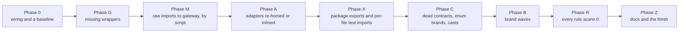

# Brands and gateways for assayer: the epic

This file is the operator's run sheet for moving assayer onto dungeonmaster's gateways and brand rules. It lists
every work item, the order they run in, who does each one, and its status. The operator is the one Claude session
that dispatches agents, runs checks, builds and commits. A fresh session must be able to pick up from this file alone.

Dungeonmaster did the same move on itself first. Its run sheet is
`../codex-of-consentient-craft/scrolls/brands-gateways-epic/EPIC.md`, called "the dungeonmaster epic" below. Its
porting guide is `bigbang/PORTING.md` in the same folder. This epic reuses their scripts and their order of work.

## What this epic does

1. Every call to something outside the repo goes through a gateway package, imported as
   `#gateway/<kind>/<subpath>`. The four kinds are `node`, `browser`, `npm` and `bin`. Every `adapters/` folder goes,
   because `adapters/` is no longer a legal folder type.
2. Every object contract, every object nested in one, and every string and number field in one carries a brand. A
   brand is a zod `.brand<'Name'>()` tag that stops a plain string from passing where a checked value is expected.
   The scripts derive each brand's name; nobody chooses one.
3. Every dungeonmaster lint rule passes at `error`, `npm run ward` exits 0, and `npm run test:syntax` exits 0.

**The standard docs outrank this file.** These are dungeonmaster's MCP tools `get-architecture`,
`get-testing-patterns` and `get-folder-detail` for each folder type, plus the `consumerGatewayWrapper` session snippet
for gateway wrappers. They say where each file goes, how it is named, what it may import, and how its test and proxy
look. Every planner and every implementing agent loads them before writing anything. Where an item below disagrees
with them, the docs win, and the operator fixes the item. Rules from them that shape this plan:

| Rule | Where it bites here |
|---|---|
| No standalone scalar contract. A lone branded string or number goes plain, or becomes a field of its owner's object contract. | P0-6, Phase B |
| A folder type is chosen by what the file does. I/O goes in `brokers/`, pure reshaping in `transformers/`, a boolean check in `guards/`. Folders are named by domain, not after a library. | D3, A-1 |
| A layer file is `<name>-layer-<suffix>.ts`, sits flat beside its parent, and nothing outside that folder imports it. Brokers nest at most 2 levels: `brokers/<domain>/<action>/`. | A-1, A-2 |
| A pass-through wrapper (a re-export only) runs real and has no proxy. A barrel-only subpath needs no stub. | Phase G |
| No root-level barrel and no `testing.ts`. `exports` holds one explicit key per folder-type barrel, plus `./*.proxy` and `./*.stub` keys carrying only `source`. | Phase X |
| Configs come from `dungeonmaster create-package`, not by hand. No config sets `composite` or a `references` array. Every jest config inherits `customExportConditions` from the repo-root base. | P0-5, D9 |
| A package Jest cannot load (it needs a canvas, a GPU, Electron or ESM) gets a module mock beside its wrapper: `packages/@gateway/npm/src/<folder>/<folder>.jest-mock.cjs`. A resolver in the Jest base config loads it for every test that imports the package, by `#gateway/npm/<folder>` or by the raw name. Never a `__mocks__` folder, never a `moduleNameMapper` entry for it, and no package config sets its own `resolver`. `gateway-sync` copies a mock along with its wrapper folder. | P0-5, G-4, M-2 |
| A caller's proxy composes the gateway wrapper's proxy, imported from its own file. A failure comes from a named scenario or a recorded-failure stub. `calledWith([])` is allowed only for a function that takes no arguments. Never mock another workspace package's export. | A-4, A-6 |

**The plan is script first.** Wherever a step is a mechanical swap, a script does it: an import rewrite, a file
move, a symbol rename, a brand added. Agents fix only what a script reports it could not do, and the semantic errors
a script's output causes. Each item below says which kind it is.

## Shorthand used in commands

```bash
E=/home/brutus-home/projects/codex-of-consentient-craft/scrolls/brands-gateways-epic   # dungeonmaster's scripts
A=/home/brutus-home/projects/assayer
H=$A/scrolls/brands-gateways-epic                                                       # this folder
FLAGS="--root=$A --scope=@assayer/ --browser-pkgs=app"
```

`$E/phase34-scripts/` and `$E/bigbang/` hold the portable scripts. Each one reads its settings from flags, and
`$FLAGS` covers assayer. `--out-dir` defaults to `$A/tmp`, which git ignores. Each script does a dry run unless you
pass the bare word `apply`. A script never deletes a file; it moves it to `$A/tmp/deletions/<step>/<original path>`.

## Where assayer stands (measured 2026-09-30)

The four research reports behind these numbers are in `census/`:

| File | What it holds |
|---|---|
| `census/gateway.md` | Every adapter and its callers, every raw import, platform globals, spawned programs, missing wrappers, lint config, design conflicts, a draft split into work groups |
| `census/brands.md` | Brand census, dead and duplicate contracts, unbranded objects, ad-hoc shapes, decision table sizes |
| `census/scripts.md` | Every reusable script: what it does, whether it runs on assayer as-is, and the command line |
| `census/rechecks.md` | The two open problems from the zod 4 upgrade session |

| Fact | Count |
|---|---|
| Typecheck | Red. 217 errors in 169 files. 151 are TS2307 "cannot find module". |
| Lint | Red. 3,604 errors in the five source packages. `raw-import-ban` alone is 1,204, and 712 of those are false hits (P0-3 explains them). |
| Adapter files | 110: core 76, app 14, desktop 14, cli 6. Each has a proxy and a test, so 330 files. |
| Adapter callers outside tests | About 93 files: core 63, app 13, desktop 11, cli 6 |
| Proxies that compose an adapter proxy | core 46, app 12, desktop 11, cli 6 |
| Raw `zod` imports | 155 files: shared 87, core 41, cli 11, app 10, desktop 6 |
| Catch-all stagings, `calledWith([])` | 128 in about 47 files |
| Contract files | 154. 78 object contracts carry no brand. 50 standalone brands: 28 used as a field, 22 never. |
| Ad-hoc object shapes | 58, of which core holds 50 |
| `z.unknown()` fields | 3 |
| Dead contracts | 2, plus 2 used only by tests |

Three causes explain most of the red:

1. Five packages use `moduleResolution: node`. That setting ignores a package's `exports` and `imports` maps, so
   neither `@dungeonmaster/shared/contracts` nor `#gateway/*` resolves.
2. Assayer imports names dungeonmaster's shared package no longer exports: `errorMessageContract` and
   `ErrorMessage` (18 files), `AdapterResult` (25 adapter files), `absoluteFilePathContract` (1 file) and
   `processCwdAdapter` (1 file).
3. The lint rules take the repo's scope from the root `package.json` name, `assayer-monorepo`. They therefore treat
   every `@assayer/*` workspace import as a raw npm import.

**Do not run a ward lint until P0-2 lands.** Ward's lint runs ESLint with `--fix`. Three brand rules are at `error`
with autofix: `require-object-contract-brands`, `require-object-contract-brands-indexed` and
`enforce-owner-field-reuse`. A ward lint now rewrites about 100 files of brand code out of order. Typecheck-only runs
are safe.

## Decisions

Every row but D7 is decided. The user has told the operator to make every further decision itself, choosing the most sustainable option, and to record each departure as a concession for the user to review all at once. The operator asks the user nothing more. Where no answer is clear, it sends agents to explore the options and picks the best. A row marked "Decided (clear winner)" was settled while planning, because a standard
doc or assayer's CLAUDE.md dictates it, or because the alternative costs more for no gain. D7 is the user's, and no
item before Z-4 waits on it. When execution shows a decided row cannot work, the operator records a concession.

| # | Question | Decision | Why |
|---|---|---|---|
| D1 | Which way to fix the scope mismatch (P0-3)? | Decided (clear winner): Rename the root package to `@assayer/monorepo`. Rename the four gateways to `@assayer/{npm,node,browser,bin}` and the starter package to `@assayer/hydration-recipes`. The cli package keeps its unscoped name `assayer`; P0-3 checks that the lint rules still treat it as a workspace package. | Six `package.json` names change. The other way renames every workspace package and every import of one. |
| D2 | Turn the three brand autofix rules off until Phase B? | Decided (clear winner): Yes. Set them to `off` in `eslint.config.js`, one repo-wide entry. B-9 turns them back on. | It makes ward's lint safe to run in Phases 0 to X. It is a repo-wide toggle for a whole rule, which assayer's "no per-site waivers" rule allows. |
| D3 | Where do the logic adapters go? This covers the 43 ts-morph walk-file layers, about 10 other ts-morph adapters, 4 typescript adapters and 5 Jest probe adapters. | Decided (clear winner): Each goes to the folder type its body fits. A file that does I/O goes in `brokers/`. A pure reshape goes in `transformers/`, and a boolean check in `guards/`. The in-memory ts-morph walk does no I/O, so it is likely `transformers/`. The A-1 planner picks each target, with a domain folder name, not `ts-morph/`. A layer becomes `<name>-layer-<suffix>.ts`, flat beside its new parent. The body stays unchanged. | They hold analysis logic, not outside calls. A move plus a rename keeps the walk byte-identical, and a script can do it (SD-2). |
| D4 | What about a rule a file cannot satisfy? Dungeonmaster turned a rule off for one file twice (its concessions 13 and 14). | Decided (clear winner): Never add a per-file `off`. Fix the rule upstream in dungeonmaster, or change the code. | Assayer's CLAUDE.md forbids per-site suppression. |
| D5 | Where does `@mantine/core/styles.css` go? | Decided (clear winner): In the Vite entry file, like dungeonmaster's concession 9. | A CSS side-effect import is not code a gateway can wrap. |
| D6 | The scaffolded `#gateway/npm/react` names React 19 exports, but assayer has `@types/react` 18. | Decided (clear winner): Re-check after P0-4. The sync copies dungeonmaster's wrapper only when the installed version fits its range and the copy compiles. Otherwise it writes a passthrough. But the sync never overwrites an existing folder, so move the current `react` folder to `tmp/deletions/` before re-running the sync. | Upgrading React is out of scope. |
| D7 | **Open, for the user.** Should `typescript` be a peer dependency? This is CLAUDE.md's "core is not ready to publish" defect. The gateway move puts `typescript` in `@assayer/npm`'s dependencies too. | Decide in Z-4, before anyone publishes. Nothing in this epic publishes. | Both places must agree, but the choice blocks no step. |
| D8 | At most how many sub-agents at once? | Decided (clear winner): Eight, as in the dungeonmaster epic. | The user set that limit there, on the same machine. |
| D9 | Assayer builds with `tsc --build` over project references. The architecture says no config sets `composite` or `references`, and `create-package` writes each package's configs. | Decided (clear winner): Adopt the dungeonmaster layout: drop `references` and `composite`, build each package in dependency order with a script modelled on dungeonmaster's `scripts/build-workspaces.mjs` (it orders packages from their dependencies and prunes stale emit), keep assayer's `copy-dist-package-json.mjs` and app's Vite build in that order, and take each package's configs from `create-package --dry-run` for its type. | A hand-kept config drifts. `composite` turns an import of an excluded file into a hard TS6307 error. |
| D10 | Assayer's Jest `globalSetup` (`scripts/jest-global-setup.js`) runs `tsc --build` over the whole repo before every Jest run, unit runs included, and aborts the run when the build fails. It exists because the generated test shim and three plain-JS runtime files in core `require` core's compiled `dist`. | Decided (clear winner): Do what dungeonmaster does: no build before tests. The shim loads the same tree its broker was loaded from. A broker running from `src` loads core's TypeScript source, and the nested Jest's ts-jest compiles it. A broker running from `dist`, as in a published install, loads `dist`. Drop `globalSetup`, and give the nested Jest config `customExportConditions` with `source`. Item P0-5b does this. | Two problems arise otherwise. Every agent's scoped unit run starts a whole-repo build in the shared checkout, and concurrent builds break each other. And while any package is red, which is most of Phases A and B, every unit run aborts before a test starts. Dungeonmaster's tests and spawned processes read source through the `source` export condition, and only a few artifact tests read `dist` (`census/d10-build-before-tests.md`). Two alternatives were rejected. Ward's own build cache (`bundleBuildBroker`, content-hashed under `.ward/bundle/`, safe to run at once) serves e2e only, and would need a dungeonmaster change to serve integration. Building only for integration runs still collides when two run at once. Both still build, so a red package still blocks every integration run. |
| D11 | Assayer links dungeonmaster by `file:` to its working checkout. A rebuild there changes the lint rules, scripts and docs under every agent at once. | Decided (user): no pin. Agents fix dungeonmaster bugs in that checkout directly: they run its ward, build the changed package and commit there. The `file:` link carries the result into assayer. The operator schedules a dungeonmaster build like an assayer build, when no assayer check is running. MCP changes reach only new agent sessions. | A fix where the bug lives is the sustainable fix, and the link makes it apply at once. |
| D12 | Which branch does the epic commit to? | Decided (user): merge `init-ast-electron` into `master` first (P0-0). The epic then runs on branch `brands-gateways`, cut from `master` in the main checkout. No other session works in the main checkout while the epic runs. No group gets its own worktree, because the worktree tool cannot carve one here (concession 4). | The git index is shared, and `run-all.sh` commits straight onto the current branch. |

## How to operate

These rules come from the dungeonmaster epic. Its section "Lessons worth keeping" explains why each one exists.

1. **The operator owns builds and commits.** An agent never builds, commits, runs `git add`, `git mv`, `git stash`,
   `git reset` or `git checkout -- <file>`, and never installs packages. The git index is shared. Before each commit,
   run `git diff --cached --stat` and stage explicit paths.
2. **Never delete a file.** Move it to `$A/tmp/deletions/<item>/<original path>` with plain `mv`, once nothing imports
   it. Scripts do the same.
3. **Script first.** For each script step, the operator runs it as a dry run, reads the summary, runs it with
   `apply`, then gates it. Each script writes a leftovers file. That file becomes the item's hand queue.
4. **No dispatch without a named-file plan.** Before an agent implements an item, `items/<id>.md` holds a `## Plan`
   section listing every file it touches, grouped into agent-sized batches. Batches are 1 to 3 files for cleanup work
   and 2 to 4 for migration work. A planner agent writes the plan when there is none. An implementing agent that finds
   another file it must touch reports it, and the operator adds it to the plan first.
5. **Every agent gets `agent-brief.md` and one item file.** Use `model: "sonnet"` for mechanical batches and opus for
   anything that needs judgement: plans, decision tables, debugging, root-level fixer rounds, integration and e2e reds.
6. **Two agents never edit one package at once**, unless the operator names disjoint file lists. Give every proxy that
   composes a changed proxy to the same agent.
7. **The gate.** After each batch, the operator runs `npm run ward -- -- <touched paths>`. That runs lint once D2 is
   in place. Before each commit, the operator also runs unit tests for every package that composes a changed proxy.
   Whenever `packages/core/src` changes, the operator runs `npm run test:syntax` too. The specimen catalogue is outside
   ward's test graph, and its output must stay byte-identical.
8. **Fix every failure you find**, including pre-existing ones. A failure an agent reports but leaves standing
   becomes a new item.
9. **Update this file in the same commit as the work.** That means the status row, the commit SHA, and any new
   concession or blocker.
10. **Record every script run** in "Scripts used", with its leftovers count.
11. **Never touch `smoke-repo/`, `vendored-fixture/` or `eslint-rules/`.** They are analyzer input or sit outside
    ward's lint graph. Specimens use raw `process` and `console` on purpose. After every script `apply`, run
    `git status smoke-repo vendored-fixture eslint-rules` and expect nothing.
12. **Write in plain language** in every file this epic touches. That covers comments, commit messages and item
    files. Assayer's CLAUDE.md has the four rules.
13. **Iterate on `--uncommitted`, then one bare run.** While fixing, the operator runs
    `npm run ward -- --uncommitted` until it exits 0, then one bare `npm run ward` as the regression pass. Give a
    long run `timeout: 600000` and wait for it in the same turn. Never `sleep` on a ward run, never `tail` its output
    file, and never re-run it unchanged. An agent never runs a bare ward.
14. **Only the operator builds, and only when the next thing it runs is compiled output.** Ward's lint, typecheck
    and unit checks read source. After P0-5b, core's in-process integration test reads source too. The CLI
    integration tests spawn the built `packages/cli/dist/bin/assayer.js`, so the operator builds before running them. Build one package with
    `npm run build --workspace=<name>`. A stale tree needs a clean build, because an incremental build can decide
    it is current and emit nothing.
15. **Never fork an agent, and never let an agent dispatch one.** A fork carries its parent's whole task and redoes it
    beside the parent. Keep each agent's context small: narrow `discover` globs, no `verbose: true` sweeps, and no
    file read twice through both `cat` and `Read`.
16. **Never hand-edit `.claude/settings.json`, `.mcp.json` or an `.env*` file.** Init generates the settings files, and
    all of them stop an automated run at a permission prompt. To change a generated entry, change dungeonmaster's
    generator and re-run init.
17. **Never run `npm link --workspaces` in the dungeonmaster checkout during the epic.** It moves every global
    `@dungeonmaster/*` link on the machine.
18. **A dungeonmaster bug gets fixed in dungeonmaster, not worked around.** When a scaffold, rule or script is wrong,
    an agent fixes it in the dungeonmaster checkout, with a test, then builds and commits there (D11). The operator
    adds a line to "Upstream reports" naming the commit. A local workaround is a concession and needs a row.
19. **Every dungeonmaster commit says why.** Its message states the problem the change fixes, not only what changed.
    Before the operator reports an item done, `git -C ../codex-of-consentient-craft status --short` shows no change
    from this epic left uncommitted.
20. **The operator runs a watchdog for the whole epic.** At the start of each session it creates a recurring cron job
    that fires every 30 minutes, at :13 and :43 past the hour. The job lives only in the session, so a new session
    creates it again. The watchdog reads the ledger `tmp/operator/agents.json`, which holds one entry per agent or long
    script: `id`, `kind` (`agent` or `script`), `item`, `started` (from `date -Iseconds`), `status`, and for a script
    its output file and that file's size at the last check. The operator adds an entry the moment it dispatches an
    agent or starts a long script, and marks it `done` when the result arrives. On each run the watchdog does this:
    - An agent running more than 60 minutes is stopped. The operator keeps its sound partial work, splits the rest
      into smaller batches, and dispatches fresh agents for them.
    - A script is never stopped for running long. A script whose output file has not grown across two checks in a row
      counts as stalled, and is stopped and resumed.
    - When nothing is running and work remains, the watchdog picks up the next items from this file.
    The watchdog exists because an agent can run past an hour, and because a script like `run-all.sh` can run for hours
    with nothing else to wake the operator. Its regular runs also keep the session's cache warm through those waits.

## The order of work



### What runs in parallel

At most eight agents run at once (D8). Two things decide what may overlap: who edits which files (rule 6), and
which step needs compiled output or a quiet tree. A script `apply`, a build, a full ward run and a `run-all.sh`
segment each need the tree to themselves, so no agent edits anything while one runs.

| Phase | Runs in parallel | Runs alone or in order |
|---|---|---|
| 0 | Planners and script ports, which only write item files or `scripts/` | Builds, installs and the baseline ward run |
| G | Every G item, one gateway folder each. Two items in one gateway package may share it only with disjoint folders; its `package.json` is staged line by line. | The gateway build after each item, and a dungeonmaster build, which changes the rules under every agent |
| M | M-2 batches, one package per agent | M-1's `apply`, one package at a time, each its own commit |
| A | A-1, SD-2 and SD-3 (planning and scripts on copies). After the scripts apply, A-4's hand batches, one package per agent. | A-2's re-home `apply`, with core's walk-file folder as its own run and commit. A-3 after A-2. A-6 after A-4. A-7 last. |
| X | Nothing within a package: each script runs leaves first, shared, core, desktop, cli, app, then `hydration-recipes`. X-4 hand batches run one package per agent. | Each package's X-1 to X-3, and the build after X-1 |
| C | C-1's reviewer beside C-2 and C-3 dry runs | Each `apply` |
| B | B-2 and SD-4 together, before B-3 | B-3 to B-6 and B-8 to B-9: `run-all.sh` segments, alone, one after another. B-7 fixer rounds: one agent per batch from `queue.cjs`, leaf packages first. |
| R | R-2's scan batches, one rule and one package per agent | R-1's `apply` |
| Z | Z-1 and Z-2's hand sweep, on disjoint files | Z-3, last |

The script-development items (SD) run beside any phase. They write only under `$H/scripts/` and `$A/tmp/`, never
`packages/`, so they collide with no one. Each must be ready before the item that needs it.

Status values: `todo`, `ready` (every item it needs is `done`), `active` (the Notes column names the agent),
`review`, `done` (Notes holds the SHA), `blocked` (Notes says why and what was tried).

### Phase 0: wiring and a baseline

Nothing else starts until P0-8 is done. These items fix why the tree is red, so later reds mean something.

| ID | What | Who | How | Needs | Status |
|---|---|---|---|---|---|
| P0-0 | D12: merge `init-ast-electron` into `master`, then carve the epic's worktree from `master` with `mcp__dungeonmaster__create-worktree`. Every later item runs in that worktree. | Operator | The worktree arrives with `node_modules` hardlinked and `dist` copied. A worktree is not hermetic, so keep the scripts' `--link-fence` on. | — | done. `master` fast-forwarded to `init-ast-electron` at `97f6f49`, not pushed. The worktree tool cannot carve a tree for assayer (concession 4), so the epic runs on branch `brands-gateways` in the main checkout, by the user's choice. |
| P0-1 | Point `@dungeonmaster/siegelense` at the `file:` checkout, then `npm install`. The install's `postinstall` re-runs `dungeonmaster gateway-sync`. | Operator | The gateways link under `node_modules/@assayer-monorepo/`. | — | done (the commit adding this epic) |
| P0-2 | D2: set `require-object-contract-brands`, `require-object-contract-brands-indexed` and `enforce-owner-field-reuse` to `off` in `eslint.config.js`. | Operator | One edit, then check the config still loads: `node -e "require('./eslint.config.js')"`. | D2 | done (the commit that marks this row). ESLint's `calculateConfigForFile` resolves all three to `0`. Ward's lint is safe to run from here on. |
| P0-3 | D1: rename the scope. That is the root, the four gateways, `hydration-recipes`, and every `@assayer-monorepo/` mention in `package.json` `imports` maps, `tsconfig*.json` and `.dungeonmaster.json`. | Script | A one-off string replace over those files only, listed first with a dry run. Then `npm install`. Record it in "Scripts used". | D1, P0-1 | done (the commit that marks this row). Only `package.json` files named the old scope. The rename alone did not stop `raw-import-ban` reporting `@assayer/*` imports, so `eslint.config.js` passes `scope: '@assayer'` to `raw-import-ban` and `bin-program-spawn-ban` (concession 5). Ward's lint now passes on core files that import `@assayer/shared/contracts`. |
| P0-4 | Re-run `dungeonmaster init`. The first run stopped when siegelense's install failed. It never added the `#gateway/*` `imports` map to app, cli, core, desktop and shared. It never moved the root tsconfig to `node16` with the `source` condition either. Before running it, re-read `get-architecture`, `get-testing-patterns` and the `consumerGatewayWrapper` snippet, so the session works from the current docs. | Operator | `npx dungeonmaster init`, then `git diff --stat`. List anything init did not do in "Upstream reports". | P0-3 | done. Init was re-run before P0-3 and wrote: the `#gateway/*` `imports` map in app, cli, core, desktop and shared; `module` and `moduleResolution` `node16` with the `source` condition in the root `tsconfig.json`; `gateway-dist` and `source` conditions in `hydration-recipes`' `tsconfig.build.json`; the module-mock line in the agent rules. The maps still name `@assayer-monorepo/*`, so P0-3 rewrites them. Re-run init after P0-3 and diff again. Done: the re-run after P0-3 changed no tracked file. |
| P0-5 | Wiring init does not do. (a) Each package's configs match what `dungeonmaster create-package --dry-run` writes for its package type, per D9: `node16` resolution, no `composite`, no `references`. Diff each one rather than hand-write it. (b) The build and `scripts/jest-global-setup.js` must build the gateways. (c) Assayer's repo-root `jest.config.base.js` is hand-written. It must spread `@dungeonmaster/testing/jest-config-base`, which brings the gateway module-mock `resolver`, the I/O trap and the home sandbox. It then adds `customExportConditions: ["source", "require", "default"]`, which the published base leaves out on purpose. It keeps assayer's own `globalSetup` build and global `testTimeout`. Its `moduleNameMapper` entries for root barrels stay until Phase X removes those barrels. No package config pins its own `testEnvironmentOptions` or `resolver`. App's config does both today. (d) `eslint.config.js` needs the plugin's gateway block, `gatewayLintConfig` and `workspacePackageNames`, modelled on dungeonmaster's own `eslint.config.js`. (e) D6: re-check the react wrapper.  (f) Each package gets the gateway packages in `dependencies`, which `gateway-dependency-declared` requires. | Agent (opus), one | A planner names the files first (rule 4). `census/gateway.md` sections 0.2, 0.4, 0.5 and 7 list most of them. | P0-4 | done except one red, in the P0-5 commit. Ward runs: typecheck PASS in all five packages (`1790830733643-0462`); clean build PASS in order `bin, hydration-recipes, node, npm, browser, shared, app, core, desktop, cli`; unit PASS for shared, core and desktop, FAIL for app's `main.test.tsx` with `ReferenceError: Response is not defined` (`1790830832780-8041`), which item P0-5c fixes; hydration-recipes integration PASS (`1790830882224-e772`); Batch 10 lint PASS on gateway files, with shared's 87 `ban-test-support-in-production` hits left for Phase X (`1790830908928-10e7`). The home sandbox held: the real home and its Claude projects folder were unchanged. Part (c) as worded would have deleted HOME (upstream report 12); `scripts/jest-global-setup.js` calls the published setup and throws if HOME did not move. |
| P0-5c | App's unit tests fail with `ReferenceError: Response is not defined` since app's Jest config inherits the root `customExportConditions`. | Agent (opus) | Find which package now loads a Node build that expects a global `Response`, and fix it in app's Jest config or setup. | P0-5 | done. App loads dungeonmaster's published `jsdom-polyfills` first, as `@gateway/browser` does. The cause was the base's MSW setup file, which needs a global `Response`. Five contract tests now assert zod 4's message text. Two mount tests render inside `act()`. App unit PASS, 68 of 68 files (`1790831653532-216d`). Three lint errors stay in the two mount tests until G-8. |
| P0-5b | D10: remove the build before tests. Files: `jest.config.base.js` (drop `globalSetup`); move `scripts/jest-global-setup.js` to `tmp/deletions/`; `packages/core/src/brokers/run/paths/run-paths-broker.ts` and `run-each-layer-broker.ts` (pick source or `dist` from where the broker itself loaded); `packages/core/src/brokers/run/unit/run-unit-broker.ts` (lines 170 to 171); `packages/core/src/adapters/jest/run-cli/jest-run-cli-adapter.ts`; `packages/core/probe-runtime.js`, `probe-transformer.js` and `harness-registrar.js`; their tests and proxies, including `assemble-shim-transformer.test.ts` and `run-unit-broker.test.ts`, which hard-code `/core/dist/adapters`; `packages/core/CLAUDE.md` section 8, rewritten in the present tense. Pass the source-or-`dist` mode by a Jest `globals` flag and transform `options`, keeping the nested config identical for every file. | Agent (opus), one | Probe three things first, because nobody has verified them: (a) whether ts-jest loads `probe-transformer.js` inside the outer Jest sandbox, (b) whether core source's `#gateway/*` imports resolve under the nested Jest, and (c) whether ward injects `--conditions=source` in assayer, which needs `node_modules/@dungeonmaster/shared/statics.ts`. Hash every specimen's run artifact before and after: `npm run test:syntax` output must stay byte-identical. That suite's own `jest.config.js` never ran `globalSetup`, so source mode also stops it reading a stale `dist`. Phase A's A-3 later moves the same `dist/adapters` paths, so A-3's planner reads this item's diff first. | P0-5 | done in the P0-5b commit. No Jest run builds anything. `runUnitBroker` picks the source or `dist` tree from where it was loaded, and `coreRuntimeStatics` holds every run-time module path. The `assayer unit` hashes over all 117 specimens (351 files) match the baseline byte for byte, from source and from `dist`. `test:syntax` passes 117 suites and 259 tests, as before. Core's run-broker integration test passes with no build (`1790831544527-a4e8`). |
| P0-6 | Replace the names dungeonmaster removed. `ErrorMessage` and `AbsoluteFilePath` were standalone scalar brands, and the contracts doc forbids those. So each use goes plain: `ErrorMessage` becomes `string`, `errorMessageContract.parse(x)` becomes `x`, and a stub wrap becomes its literal. Where the value is a field of an object contract (`ipcReplyContract`'s error), that field gets its own inline brand, such as `.brand<'IpcReplyError'>()`. Swap `processCwdAdapter` in `packages/cli/bin/assayer.ts` for `cwd` from `#gateway/node/process`. Leave `AdapterResult` alone. It lives only in adapter files, and Phase A removes it. | Script, then agent (sonnet) | `$E/merge-master/plain-brand-residue.cjs` does exactly this rewrite. It needs the two deleted contract files laid out under `--deletions`, copied from dungeonmaster's git history, and a port of its `@dungeonmaster` and `packages/shared` literals. The agent works its leftovers. P1 error text stays word for word. | P0-5 | done. The port is `$H/scripts/p0-6/`. It made 53 rewrites in 22 files with 0 leftovers. The field brand is `IpcReplyMessage`, because the field is `message`. An agent swapped `processCwdAdapter`, moved the CLI entry's other `process` uses to `#gateway/node/process`, and rewrote four stale comments. No typecheck error names a removed name. |
| P0-7 | Typecheck to green apart from the known `AdapterResult` reds. | Fixer rounds | `node $E/bigbang/tools/diag.cjs $FLAGS --full --jobs=3 --out=tmp/diag-p0.json`, then `graph.cjs` and `queue.cjs` (see "Fixer rounds"). | P0-5b, P0-6 | done in the P0-5 commit. Typecheck passes in all five packages with 0 errors (`1790830733643-0462`), once RC-2 was fixed upstream and `AdapterResult` moved into assayer's shared package (concession 13). No fixer round was needed. |
| P0-8 | Baseline. Record full `npm run ward` and `npm run test:syntax` run ids here. They answer "was it already red" later. Re-check RC-1 and RC-2 below. | Operator | | P0-7 | done. Full ward run `1790832052277-4919` at `b8378b7`: typecheck PASS (0 failed files); lint FAIL, 572 files, and the `@assayer/bin` lint crashed; unit FAIL, 208 files (cli 12, core 80, desktop 9, shared 101, browser gateway 107, npm gateway 1); integration FAIL, 4 files (cli, browser gateway); e2e ran 0 of 10 files. `npm run test:syntax`: 117 suites and 259 tests PASS. RC-1: typecheck is clean in desktop. RC-2: resolved upstream. Item P0-9 fixes the reds no later phase owns |
| P0-9 | Fix every baseline red that no later phase owns: unit, integration and e2e failures, and the `@assayer/bin` lint crash. | Agents, after a triage | The triage and plan are `items/p0-9.md`. Every dungeonmaster fix is committed there with its reason in the message. | P0-8 | done. A: 94 test files assert zod 4's text (`d88fc7e`). B: gateway Jest configs pin their export conditions (dungeonmaster `957dc5f`, `fd6002a`). C: ward passes `--conditions=source` as a node argument, never through `NODE_OPTIONS`, so a test's spawned child loads `dist` (dungeonmaster `5f0f02d`); CLI integration PASS (`1790834250886-2c69`). D: the I/O trap lets ts-morph's own compiler reads through (dungeonmaster `1c523ec`). E: 4 find-up adapter tests stay red until A-4 removes the adapters. G: gone since G-1. H: the slow file builds a fresh ts-morph project per test and crosses 1 s only under whole-repo load, so Phase B's full runs judge it again. `ban-anonymous-jsx-in-map` passes after a widget refactor (`a32093d`). |

### Phase G: missing wrappers

The `consumerGatewayWrapper` session snippet sets the layout: one folder per wrapper under
`packages/@gateway/<kind>/src/<subpath>/`, holding the wrapper file plus its `.proxy.ts` and `.stub.ts`. A
pass-through subpath that only re-exports a library (`typescript`, `ts-morph`, the Testing Library and Playwright
re-exports) runs real in tests and has no proxy, and a barrel-only subpath needs no stub. A wrapper with a real body
(`git`, `vm`, `electron`'s IPC) gets a proxy. From its first commit, that proxy has a read-back (`getCallsFor`, which
returns every call's argument tuple in order), stages answers by exact arguments, and offers named failure scenarios.
Copy a shape from `node_modules/@dungeonmaster/{npm,bin}/src`, but never import dungeonmaster's own gateway. The
operator builds the gateway packages after each item, because other packages typecheck against their compiled output.
Items G-1 to G-6 can run side by side, since each owns a different folder.

| ID | What | Who | How | Status |
|---|---|---|---|---|
| G-1 | `#gateway/bin/git`. Copy dungeonmaster's `gitRun`, `currentBranch`, `headSha` and `verifyRef`. Add `lsTree`, `catFileBlob`, `branchList` and `isInsideWorkTree` for core's 7 git call shapes. Then move the `bin` placeholder `src/index.d.ts` out. | Script copy, then agent | Copy `node_modules/@dungeonmaster/bin/src/git/` and rename the scope. The agent adds the four new calls. A missing `git` keeps assayer's exact P1 text. | done. Copied from dungeonmaster's `packages/@gateway/bin/src/git/`, plus `lsTree`, `catFileBlob`, `branchList`, `isInsideWorkTree` and a ninth function, `resolveRef`, for `rev-parse [--short] <ref>`. A missing `git` throws `GitNotInstalledError`; core's callers today fall back silently instead, so A-4 keeps that fallback by catching the error. The bin gateway now depends on `@assayer/node`. Ward PASS, 36 files (`1790833032262-00b3`). |
| G-2 | `#gateway/node/vm`, exposing only what the harness sandbox needs. The sandbox itself must never reach a gateway import. | Agent | CLAUDE.md "Harnesses fill only the gaps" sets the limits. | done. A pass-through of `createContext` and `runInContext`, the two calls core's harness loader makes, with no proxy: the docs say a re-export runs real. Its test proves code in an empty context sees no `require`, `process` or `module`. Ward PASS (`1790832726705-9b53`). |
| G-3 | `#gateway/npm/typescript`: add 8 names. They are `findConfigFile`, `isExpression`, `isStatement`, `parseJsonConfigFileContent`, `readConfigFile`, `transform`, `transpileModule` and `visitEachChild`. | Agent (sonnet) | | done. All 8 names are used. The type `TransformationContext` is added too, because the probe-inject adapters name it. Ward PASS (`1790832688071-970d`). |
| G-4 | `#gateway/npm/electron`: `app`, `BrowserWindow`, `Menu`, `ipcMain`, `ipcRenderer`, `contextBridge`, and the default export, which is a path string outside Electron. The proxy stages by IPC channel. Jest cannot load Electron's main and renderer APIs, so the folder also gets `electron.jest-mock.cjs`, which the base resolver serves. That replaces the 3 `registerModuleMock` calls in desktop's electron proxies. | Agent (opus) | No dungeonmaster original exists. Keep `sandbox: false`. Keep the preload's imports small. | done. The barrel passes through only the names desktop uses, so the base resolver maps `#gateway/npm/electron` to `electron.jest-mock.cjs` and never the raw name. The mock and the proxy share one stand-in from `electron-double.stub.ts`, which follows Electron's own rules (a second handler on a channel throws). The proxy stages `invoke` by exact arguments and `loadURL` by URL, with five named failures. Electron is an optional peer dependency. Ward PASS (`1790833728635-90c0`). `items/g-4.md` says what A-4 changes in desktop's three proxies. |
| G-7 | App's `src/__mocks__/` folder and its CSS `moduleNameMapper` entry. D5 moves the stylesheet import to the Vite entry, so tests import no CSS and `style-mock.cjs` can go. `jsdom-polyfills.cjs` is a setup file, not a module mock, so it moves out of `__mocks__` to wherever `create-package` puts a jsdom package's setup. Check whether the codemirror packages load in Jest. Any that do not get a `.jest-mock.cjs` in their gateway folder. | Agent (sonnet) | | done. `@mantine/core/styles.css` is imported by `src/main.tsx`, the Vite entry, which no test runs, and the Vite build still emits the stylesheet. App's `setupFiles` is only the published `jsdom-polyfills`. `style-mock.cjs`, `jsdom-polyfills.cjs` and the CSS mapper entry are gone. All three codemirror packages load in Jest, so none needs a module mock. App unit PASS, 68 of 68 (`1790832831889-40e9`). `raw-import-ban` no longer flags the stylesheet import (upstream report 16). |
| G-8 | `gateway-sync`'s passthrough wrapper is `import pkgModule = require('<pkg>'); export = pkgModule;`. App is an ES-module project, so importing it fails with TS1202 and TS1203. Fix the passthrough template in dungeonmaster (upstream report 15), re-generate `packages/@gateway/npm/src/react/` from it, then point app's two mount tests (`react-dom-mount-adapter.test.ts`, `app-mount-responder.test.ts`) at `act` from `#gateway/npm/react`. Their `raw-import-ban` errors and one `enforce-import-dependencies` error close with it; the other two `enforce-import-dependencies` errors belong to Phase A. | Agent (opus), in dungeonmaster then assayer | done. Dungeonmaster `a0db985` and `780929f`: a passthrough for an `export =` package re-exports `default` plus every value and type name, which a new broker reads from the package's type declarations. `export *` fails there with TS2498. React was the only old-form folder; it is regenerated. App's two mount tests import `act` from `#gateway/npm/react`. Ward PASS (`1790833857573-3e04`). |
| G-9 | Two dungeonmaster fixes, then copy them into assayer. (a) `run` in `packages/@gateway/node/src/child_process/run/run.ts` joins stdout and stderr into one `output` and decodes each chunk on its own, so a git warning or a multi-byte character split across chunks corrupts a blob read. `catFileBlob` and `lsTree` need stdout alone, decoded once. (b) `@dungeonmaster/gateway-colocation` reads export names out of comment text. | Agent (opus), in dungeonmaster then assayer | done. Dungeonmaster `76d1f14`: `run` returns `stdout` and `stderr` apart, each decoded once from the joined bytes, and keeps `output` for existing callers; every bin `*-run` wrapper carries both. Dungeonmaster `ba5a0cc`: `gateway-colocation` reads wrapper exports from the AST. Assayer's `run` and bin wrappers are copied, and all seven git functions that parse output read `stdout`. Bin gateway ward PASS (`1790834073361-8895`). |
| G-10 | Upstream report 14: a gateway test that imports another gateway reads that gateway's `dist`. The `source` condition cannot fix it: under `source`, `@dungeonmaster/testing` resolves to `src/` while the published base's MSW setup loads `dist/`, so a test stages its responses on an MSW server that never answers. Add a gateway-only export condition to the generated gateway `package.json` and name it in the gateway Jest configs, in dungeonmaster's templates, then regenerate assayer's. | Agent (opus), in dungeonmaster then assayer | done. Dungeonmaster `fe4da94`. Each generated gateway export entry carries `gateway-source`, and every gateway Jest config names it first. A probe test proved a browser gateway test loads the node gateway's `src/`, and loads `dist/` with the condition removed. All four gateways' configs and exports match the templates byte for byte. Gateway ward PASS: 349 unit and 9 integration files (`1790834244945-5660`). |
| G-11 | Two gaps A-1 found. Desktop's `node-child-process/exec` needs a wrapper that merges `env`, ignores stdin, calls back on every stdout and stderr chunk, and returns stdout and stderr apart. Desktop's `node-child-process/spawn` needs a detached launch with stdio ignored and `unref()`; `spawnDetached` today requires file descriptors and never calls `unref()`. | Agent (opus), in dungeonmaster where the change is general, then assayer | done. Dungeonmaster `36f0ff0`: `run` takes `stdin: 'ignore'` and live `onStdout`/`onStderr` callbacks, so desktop's exec inlines to `run`. `spawnDetached` already calls `unref()`, but it throws when no pid exists, while Node reports a failed start later through `'error'`; desktop's launch needs that reason, so assayer's gateway adds `spawnFireAndForget({ command, args, onStartFailure })`. `items/g-11.md` gives A-4's exact calls. Ward PASS (`1790836440589-9296`). |
| G-12 | The node gateway's `stdoutProxy` cannot stage `stdout.isTTY`, so a caller's proxy has to set it on the real stream. Add an `isTTY` staging to the proxy in dungeonmaster, then copy it into assayer. | Agent, in dungeonmaster then assayer | done. Dungeonmaster `8cb03aa`: `stdoutProxy().setupIsTty({ value })` stages true, false or undefined; creating the proxy resets it to false. Copied into assayer; ward PASS (`1790836406445-cdba`). |
| G-5 | `#gateway/npm/testing-library__react` and `testing-library__user-event` | Script copy, then agent | Copy from dungeonmaster's `@gateway/npm`. | done. Both wrappers are copied, with their stubs and tests, and declared in `@assayer/npm`'s `dependencies`. Their jsdom tests pass since P0-9 cluster B (`1790833650688-ef14`). |
| G-6 | `#gateway/npm/playwright__test` and `#gateway/bin/npm` (`runBuild`, for `app/test/e2e-global-build.ts`) | Script copy, then agent | Same. | done. `#gateway/npm/playwright__test` is a pass-through. `#gateway/bin/npm` has `runBuild({ cwd, workspace? })`, where no workspace means the root `npm run build`, plus a missing-npm scenario. Ward PASS (`1790833246266-ee01`). |

### Phase M: raw imports to the gateway, by script

Dungeonmaster's A18 codemod does this step. It censuses one package's raw imports and globals with ESLint. It swaps a
raw import only when the gateway barrel hands back the identical symbol, as checked by TypeScript. Then it
re-typechecks and re-lints each changed file, and it rejects any file that gains a problem. It also covers `zod`. The
committed copy is `$H/scripts/a18-codemod/`.

| ID | What | Who | How | Needs | Status |
|---|---|---|---|---|---|
| SD-1 | Port the codemod. Three hard-coded spots change. `ROOT=process.cwd()` takes `--root`. `tmp/a18-codemod` takes `--out-dir`. `a18-census.config.js` must require `@dungeonmaster/eslint-plugin` instead of dungeonmaster's own source. Prove it with a dry run on `shared`. | Agent (sonnet) | Writes only in `$H/scripts/`. | P0-8 | done. `node $H/scripts/a18-codemod/run.cjs <pkg> --root $A --out-dir $A/tmp/a18-codemod`, plus `--apply`. The census passes `scope: '@assayer'`. The dry run on shared would swap all 87 raw `zod` imports to `#gateway/npm/zod`, with 0 rejected |
| M-1 | Run it per package in this order: shared, core, desktop, cli, app. Skip `hydration-recipes`, which has no outside calls. | Script | `node $H/scripts/a18-codemod/run.cjs <pkg>`, read the report, then add `--apply`. Each package is its own commit. | SD-1, Phase G | done. shared 87 files, core 161, desktop 14, cli 18, app 75; 0 rejected anywhere. Leftovers per package are in `$H/scripts/a18-codemod/leftovers/`: core 45, desktop 29, cli 20, app 10. Typecheck PASS in every package; the only unit reds are cluster E's four find-up adapter files (`1790835307453-f66c`, `1790834605821-d52a`); `test:syntax` 117 of 117. |
| M-2 | The hand queue from M-1's REJECTED files. The codemod skips anything a test or proxy mocks raw, and those mocks go in Phase A. It also covers platform globals in 6 production files: `process` in desktop and cli, and `document`, `location` and `globalThis` in app. Also the harness spawns of `process.execPath` (2 cli harnesses, app `smoke-cache.harness.ts`). Also D5's CSS move and app's Playwright harnesses. | Agents | Batches come from M-1's leftovers. | M-1 | done. Core's test harnesses, desktop's run broker, cli's two harnesses and app's harnesses, e2e build and Playwright config reach `fs`, `process`, `git` and `npm` through the gateway. Cli and app depend on `@assayer/bin`. `eslint.config.js` types each file against its own package's tsconfig, so `test/` and `bin/` files are linted. CLI integration PASS (`1790836317786-8bc1`), `test:syntax` 117 of 117. What M-1 left in `adapters/` is Phase A's. |

### Phase A: adapters, re-homed or inlined

Every adapter does one of two things. A thin adapter wraps one outside call that a gateway already offers. It
dissolves into its callers: each caller calls the gateway, and each caller's proxy composes the gateway proxy. A
logic adapter holds assayer's own logic. It moves to the folder type D3 names, keeping its body unchanged.

| ID | What | Who | How | Needs | Status |
|---|---|---|---|---|---|
| A-1 | The adapter table. One row per adapter (110 rows) gives: inline or re-home, the target path and symbol for a re-home, and the gateway call for an inline. The planner calls `get-architecture` and `get-folder-detail` for `brokers`, `transformers` and `guards` first, and every target path must pass their naming, depth, layer and import rules. Write it to `items/a-adapter-table.md`. Start from `npx adapter-census --format=json`. That census skips the 46 `*-layer-adapter.ts` files, so add those from `census/gateway.md` appendix A. | Agent (opus), planner | Judgement. The script reads the table, so keep it in one fixed column shape. | D3, P0-8 | done. `items/a-adapter-table.md`: 110 rows (core 76, app 14, desktop 14, cli 6; 47 are layer files). 39 inline, 71 rehome, 0 delete. Two gateway gaps go to G-11. The sha256 adapter becomes a transformer, so every cache-key hash stays in one file. |
| SD-2 | Re-home script. For each re-home row it does three things. It moves the adapter, its proxy and its test with TypeScript's `getEditsForFileRename`, which rewrites every importer. It renames the exported symbol and the proxy's symbol with the language service, which `$E/phase34-scripts/b15-rename/rename.cjs` already wraps. It prints any string that names the old path. | Agent (opus) | Writes only in `$H/scripts/`. Prove it on a copy with `--sample-out` and `$E/phase34-scripts/lib/verify-sample.cjs`. | A-1 | done. `$H/scripts/sd-2-rehome/rehome.cjs`, proven on a copy, then used by A-2. |
| SD-3 | Inliner for thin adapters. It rewrites each call to the gateway call shape from A-1's table, swaps the caller proxy's import to the gateway proxy, and lists every staging it cannot translate. This is the script dungeonmaster planned as `migrate-adapter` and never built. **Go or no-go:** build it only if a trial on 3 adapters removes at least 20 hand edits. Otherwise agents do A-4. | Agent (opus) | Scope: about 30 thin adapters and about 80 callers. | A-1 | done. `node $H/scripts/sd-3-inline/sd3-inline.cjs <root> [apply] [--rows=...]`. On a copy it inlined 32 of 39 rows (core 13 of 16, cli 2 of 2, desktop 6 of 8 plus the 2 G-11 rows, app 11 of 11), and every typecheck error left sits on a line it reports as LEFT. Its leftovers are A-4's hand queue: stagings and read-backs with no path, lost default stagings, direct `registerMock` of an adapter, and five whole rows (git, readdir, both find-ups, desktop read-source). |
| A-2 | Run SD-2 over every re-home row. Core's walk-file folder (43 layer files plus the main adapter) runs alone as its own commit. `npm run test:syntax` must stay byte-identical. | Script | | SD-2, Phase M | done. Walk-file done: `rehome.cjs --rows=walk-file apply` moved 43 rows (129 files, 255 written) to `packages/core/src/transformers/walk-file/`, with 0 refused; in `smoke-repo` only the `paths` entry and 103 specimen test files changed (concession 15). The `assayer unit` hashes over all 117 specimens are byte-identical before and after; `test:syntax` 117 of 117; core typecheck and integration PASS, unit red only on cluster E (`1790839033703-b315`). The other 28 rows moved next (84 files, 175 written). Typecheck PASS in core, cli, desktop and app; `test:syntax` 117 of 117. Path strings the script lists but never rewrites broke two things, which A-3 fixes: the runner's module paths (119 tests in `run-unit-broker.integration.test.ts`) and an absolute path in desktop's `compiled-file-resolve-broker.test.ts` (`1790839858513-cd8d`). |
| A-8 | The walk-file layers' proxies create 88 child proxies their implementations never import by name (`enforce-proxy-child-creation`, "phantom proxy creation"). The baseline reported the same hits at the old path. The walk is mutually recursive (`walk-node` and `dispatch-node` reach each other), so the proxy graph cannot simply follow the import graph. Design how the recursion's proxies wire up so the rule passes without a suppression, and without breaking `packages/core/CLAUDE.md` section 8's leaf rule for `handler-result`. | Agent (opus) | done. The cause was not the recursion: a transformer runs real and needs no proxy, so the rule counts no import as needing a child proxy, and every child creation left over from `adapters/` read as phantom. All 31 layer proxies are now empty. 0 hits; typecheck, unit and `test:syntax` PASS (`1790839638312-425d`). Four broker proxies that create `walkFileTransformerProxy` (analyze-extract, compile-process-file, resolve-sibling-callee, run-unit) are A-4's. `packages/core/CLAUDE.md` section 8's adapter-layout traps are Z-1's. |
| A-9 | After A-4: remove, by script, every proxy creation of a transformer, guard or statics proxy (they run real, so `enforce-proxy-child-creation` reports each as phantom), with its import. | Script, then operator | done. `$H/scripts/a-9-proxy-strip/strip.cjs apply`: 19 creations and their imports removed from 15 core proxy files. Typecheck and unit PASS there; lint left only with A-6's `ban-proxy-empty-called-with` (`1790843684758-9d49`). Two hits stay for hand work: desktop's `compiled-file-resolve-broker.proxy.ts` reaches `walkFileTransformerProxy` through core's `testing` barrel, and `desktop-launch-broker.proxy.ts` creates an `adapters/` proxy (A-7). |
| A-10 | Core's `runPathsBrokerProxy` answers every path with one `RunResultStub()` and has no read-back, so cli's `unit-run-responder.test.ts` can no longer check which paths `runPathsBroker` received, or their order. Give the proxy per-path staging and a `getCallsFor` read-back, then restore that check. A-6 left `runPathsBrokerProxy`'s hash and run-each stagings matching the argument's shape, not its values. | Agent | done. `runPathsBrokerProxy.runsEachPath` stages a result per path by exact values, and `getCallsFor` returns every call's relPaths, root and cacheDir in order. Cli's unit-run test again asserts the exact relPaths, in order. Ward PASS (`1790845859579-b4a1`); `test:syntax` 117 of 117. |
| A-11 | `packages/cli/bin/assayer.integration.test.ts`'s determinism test failed once in three runs during A-6's fixer round, then passed. Assayer requires determinism everywhere, so find the cause: run it repeatedly, and compare two outputs byte by byte. | Agent (opus) | done: diagnosed, fixed in A-12. Not a flaky test: the manifest's `assayerVersion` hashes the live `packages/{core,shared}/src` even when the CLI runs from `dist`, proxies and stubs included, so an edit between the test's two compiles changes it. Fifteen quiet runs pass; one controlled proxy edit reproduces the failure with only `assayerVersion` differing. |
| A-12 | Make `assayerVersion` hash exactly the code that runs: the tree the running code was loaded from (source or `dist`, as `coreRuntimeTransformer` decides), implementation files only, never proxies, stubs, tests or harnesses. Files: `packages/core/src/brokers/analyzer/hash/`, the guard or statics it uses, `packages/cli/src/brokers/analyzer-roots/resolve/`. | Agent (opus) | done. `analyzerRootsResolveBroker` returns the `dist` roots when the CLI loaded from `packages/cli/dist`, the `src` roots otherwise. `analyzerHashBroker` keeps `.js` for a `dist` root and, for a source root, only what the new `isAnalyzerCodeFileGuard` accepts (no proxy, stub, test, harness, `.d.ts` or scratch file). Tests prove a proxy or stub edit leaves the hash unchanged and an implementation edit changes it. Ward PASS (`1790846004209-23b6`); `test:syntax` 117 of 117. Still outside the hash: core's three ceremony `.js` files at the package root, which run; they need a third root or a named file list. Verified after a clean build: the CLI determinism test passed 5 of 5, and two `status` compiles with a core proxy edited between them wrote byte-identical manifests. |
| A-3 | The Jest probe adapters. Generated test shims and three plain-JS runtime files load them by the path string `<coreRoot>/dist/adapters`. Change the shim generator (`assemble-shim-transformer`, `run-unit-broker`), `core/probe-runtime.js`, `core/probe-transformer.js` and `core/harness-registrar.js` together. A script cannot see these paths, because they are strings. | Agent (opus), one group | `census/gateway.md` section 8.2 lists every file. | A-2 | done, widened to every path string, generated export name, test describe name and comment A-2 left naming an old file, in 168 files. `coreRuntimeStatics.modules`, the shim template and the three ceremony files name the moved run-time modules. Ward: typecheck and integration PASS, unit red only on cluster E (`1790840869935-05dd`); `test:syntax` 117 of 117. Mentions in `CLAUDE.md` files, `plan/`, `eslint-rules/` and `specimen-registry.ts` are Z-1's. |
| A-4 | Thin-adapter callers. Run SD-3 if it was built, then work its leftovers. Otherwise the whole queue goes by hand, in `census/gateway.md` section 9's groups CG1 to CG9, DG1 to DG4, CL1 to CL3 and AG1 to AG6. Dungeonmaster's `items/a12-adapters-shared.md` has the recipe and its traps. | Script, then agents | Never mock a gateway wrapper that has a real body with `registerMock({ fn })`. A git caller catches `GitNotInstalledError` where it falls back silently today: `packages/core/src/brokers/git/{current-branch,detect-stable-branch,resolve-commit,ls-tree,cat-file}`. | SD-3 decision, Phase G | done. The SD-3 inliner applied (`3d1af34`), then 24 hand batches (`items/a-4.md`) and one fixer round finished its 352 leftover lines. Git brokers keep their missing-git fallbacks (concession 16). Ward after the last batch: core typecheck 0 errors; integration PASS in core, cli, desktop and app; unit red only on the two old adapter tests A-7 moves out. CLI integration PASS on a fresh build (`1790843642967-e504`); `test:syntax` 117 of 117. |
| A-5 | Remove `AdapterResult` from the re-homed brokers, so a function returns its value or throws. `$E/phase34-scripts/b18-adapter-result/run.cjs` does this but has no `apply` mode. **Go or no-go:** add `apply` if its dry run on assayer covers most of the 25 files. | Script or agents | | A-2 | done, ahead of A-2. `$H/scripts/a-5-adapter-result/run.cjs ... apply` (dungeonmaster's b18 script plus an apply mode that writes only what its verify step proved clean): 25 functions return their value or throw, 42 files rewritten. Assayer's own `AdapterResult` type is gone (concession 13 is closed). App's two mount tests now assert the rendered content through `screen.getByTestId`. Typecheck PASS in all five packages; unit reds are only cluster E (`1790837303850-9870`); `test:syntax` 117 of 117. |
| A-6 | Catch-all stagings. A regex finds 128 `calledWith([])` sites in about 47 files, but some stage a function that takes no arguments, such as `Date.now` or `process.cwd`, and those stay. The rule's scan, not the regex, gives the list. Each one it reports becomes a stage addressed by exact arguments. Then `$E/phase34-scripts/t05-recorded-failures/run.cjs <pkg> apply` turns hand-made errors that carry a Node `code` into the gateway proxy's recorded failure. | Agents, then Script | Scan with `npm run ward -- scan @dungeonmaster/ban-proxy-empty-called-with`. | A-4 | done. The rule's scan found 61 hits in 28 files; 8 batches and a fixer round brought it to 0 in every package. Proxies that mocked another package's broker compose its proxy instead. `run-execute-cases` and its proxy import `runCLI` from `#gateway/npm/jest__core` together, because a proxy mocks the module it imports from. Core typecheck 0 errors, core integration PASS, unit red only on the old `fs-find-up` adapter test (`1790845297927-ef8b`); cli and desktop unit and typecheck PASS apart from the old entry-path adapter test (`1790845300242-7d8b`); `test:syntax` 117 of 117. The broker mocks left are staged by real arguments and cover `ts.sys`, which no gateway stages (R-2). |
| A-7 | Move out every `adapters/` folder that is now empty of users, plus `core/adapters.ts`, core's `./adapters` export, and the `@assayer/core/adapters` Jest mapper entry. | Operator | Prove nothing imports each file first. | A-3 to A-6 | done. Every `adapters/` folder is in `tmp/deletions/A-7/` (115 files) after `discover` showed no importer. Desktop's launch uses `spawnFireAndForget`; its compiled-file broker imports `walkFileTransformer` from `@assayer/core/transformers`; core's `brokers.ts` re-exports `caseInterpretBroker` and `probeRuntimeCreateBroker`. `packages/core/adapters.ts`, core's `./adapters` export and the `@assayer/core/adapters` Jest mapper entry are gone. Typecheck, unit and integration PASS in core, cli, desktop and app (`1790846648987-957c`); `test:syntax` 117 of 117. |

### Phase X: package exports and per-file test imports

A test imports each stub and proxy from its own file, never through a barrel. These are dungeonmaster's B03 scripts.
Run them per package, leaves first: shared, core, desktop, cli, app, `hydration-recipes`.

| ID | What | Who | How | Status |
|---|---|---|---|---|
| X-1 | Each package's `exports` holds `./package.json`, `.` where the package has an entry, one explicit key per folder-type barrel (`./contracts` and so on, never a two-star pattern), and single-star `./*.proxy` and `./*.stub` keys carrying only `source`. Barrels move into `src/<folder type>/<folder type>.ts`. No root-level barrel and no `testing.ts` remain. | Script | `node $E/phase34-scripts/b03-exports-barrels/run.cjs <pkg> $FLAGS`, then `apply`. Build that package straight after, because the barrels moved. Core's root `.js` files and its `./testing` key need a read of the dry run. | done. shared: its two barrels moved to `src/contracts/contracts.ts` and `src/transformers/transformers.ts`, with `./*.proxy` and `./*.stub` export keys; 0 leftovers. Smoke-repo's `@assayer/shared/contracts` path and the repo-root Jest mapper entry for it followed (concession 15). Typecheck PASS in all five packages; unit PASS, 491 of 491 files (`1790847318529-246d`); `test:syntax` 117 of 117. core done: `brokers`, `contracts` and `transformers` barrels moved into `src/`; `index.ts`, `testing.ts` and the three ceremony `.js` files stay at the root; 0 leftovers; the two root Jest mapper entries for the moved barrels are gone. Typecheck, unit (401 of 401) and integration (18 of 18) PASS in core, cli, desktop and app (`1790847602412-bae5`); `test:syntax` 117 of 117. desktop: its `brokers` barrel moved into `src/`, and its mapper entry is gone. cli and app gained `./package.json`, `./*.proxy` and `./*.stub` keys; `hydration-recipes` already matched. After a clean build, typecheck, unit (401 of 401) and integration (18 of 18) PASS (`1790848090796-7a35`). The `./testing` keys of core and desktop stay until X-2 and X-3 empty them. |
| X-2 | Stub and proxy imports to per-file specifiers: 219 from `@assayer/shared/contracts` and 15 from `@assayer/core/testing` | Script | `node $E/phase34-scripts/b03-per-file-imports/rewrite.cjs $FLAGS --targets=<pkg>`, then `apply` | done. 226 import statements in 217 files (app 55, cli 27, core 113, desktop 22) now import 422 stub and proxy names from their own files (shared 386, core 35, desktop 1); 0 leftovers. Typecheck PASS and unit PASS, 491 of 491 (`1790848558411-3b31`); `test:syntax` 117 of 117. |
| X-3 | Drop stub and proxy lines from production barrels. This clears most of `ban-test-support-in-production`'s 122 hits. | Script | `b03-strip-barrels/run.cjs <pkg> $FLAGS apply`, then `b03-stub-type-alias/run.cjs $FLAGS apply` | done. `b03-strip-barrels` dropped 95 stub and proxy re-exports from shared's and core's production barrels and moved core's and desktop's `testing.ts`, which had 0 importers after X-2, to `tmp/deletions/3.3/`; their `./testing` export keys and Jest mapper entries are gone, so the root Jest config maps nothing. `b03-stub-type-alias` had nothing to change. After a clean build: typecheck, unit (491 of 491) and integration (18 of 18) PASS (`1790848789445-8af2`); `test:syntax` 117 of 117; `ban-test-support-in-production` scans 0 everywhere. |
| X-4 | Hand queue: production files that call a stub to build data. Each gets redesigned to build its value without one. | Agents | Batches from `out/leftovers.json` | done: empty. The `ban-test-support-in-production` scan after X-3 finds no production file that calls a stub. |

### Phase C: contracts, enum brands, casts

| ID | What | Who | How | Status |
|---|---|---|---|---|
| C-1 | Dead contracts: app `exit-code`, shared `resolution-failure-reason`, and the 2 used only by tests. A reviewer drops any contract reached through a string, a dynamic import or a fixture. | Agent reviews, then Script | `b02-contract-index/index.cjs $FLAGS`, review, then `b02-contract-index/delete.cjs <list> $FLAGS --verify`, then `apply` | done (`346b0a2`). A fresh scan found no user beyond the barrel lines. Core's `dir-entry` and `git-exec-result` and shared's `resolution-failure-reason` moved to `tmp/deletions/C-1/`; brand wave W1 had already moved app's `exit-code`. The 2 cli test-harness contracts stay. Lint and typecheck PASS (`1790870645595-6072`). |
| C-2 | Enum contracts take no brand. Drop `.brand` from the 10 branded enums and unwrap their stub calls. | Script | `b15-enum-brands-off/run.cjs $FLAGS apply`, then the `b15-stub-unwrap` commands it prints | done. 10 enum contracts lost their brand (shared 6, app 2, core 1, cli 1), with 0 new diagnostics in every package's gate; `b15-stub-unwrap` unwrapped 18 stub calls. 18 enum brands inside another contract's field stay for Phase B (`tmp/phase34/b15-enum-brands-off/out/inline-enum-brands.txt`). |
| C-3 | `as never` casts in tests: 59 of them. A cast goes only where the file's typecheck stays identical. | Script | `b15-as-never/run.cjs <pkg> $FLAGS apply` per package. Kept casts wait for Phase B. | done. 17 `as never` casts removed (shared 8, core 5, app 3, desktop 1); 18 load-bearing casts kept for Phase B (shared 16, core 1, app 1). Typecheck PASS; unit PASS 491 of 491 (`1790849448491-61c7`); `test:syntax` 117 of 117. |

### Phase B: brand waves

This phase follows `$E/bigbang/PORTING.md` sections 3 to 7. Its driver, `run-all.sh`, applies each wave's script and
commits each run while the tree is red. Fixer rounds then clear the fallout. The run commits straight onto the
current branch, so run it on a branch carved for it.

| ID | What | Who | How | Status |
|---|---|---|---|---|
| B-1 | Re-run every census. Phases A and X change the counts. | Script | `$E/phase34-scripts/brand-census/census.cjs $FLAGS`, then `b12-object-brand-fallout/run.cjs $FLAGS --census`, `b14-shape-contracts/run.cjs $FLAGS --census`, `b11-contract-merge/census.cjs $FLAGS` | done. 78 object contracts carry no brand (shared 45, core 25, app 4, cli 2, desktop 2); 56 ad-hoc shapes (core 50); 0 contract names declared in two packages. Output under `tmp/phase-b/` and `tmp/phase34/`. |
| B-2 | The decision file, `items/b-brand-decisions.md`. It uses the table shapes PORTING section 3 gives: 2.2 owned ids, 2.4 ownerless ids (`CoverageId`, `RunId`), 2.6 value brands (about 26), 2.8 plain brands (22) and item 3 (`z.unknown()`, 3). | Agent (opus), planner, read-only except that file | Judgement. Expect about 55 rows. | done. `items/b-brand-decisions.md`: 53 rows (2.2 owned 0; 2.4 ownerless 3: `CoverageId` on a new `coverage` owner, `RunId` on `runResult.runId`, `StubKey` on a new `stub-entry` owner; 2.6 value 25; 2.7 shared texts 5; 2.8 plain 22; item 3: 3). Operator decisions: the owner is named `coverage` so the derived text stays `CoverageId`; W5 runs WITHOUT `--allow-drop-validation`, so `ContentHash` keeps its regex check and its brand waits; harness `inputs` stays `z.unknown()` until R-2 types its callback values; B-7 checks IPC payloads for nested `undefined` after W8 and retypes core's 8 `runId` parameters to `RunResult['runId']` by hand. W1's list comes from table 2.8, not the census class column (`TreeNodeName` in desktop is plain). |
| SD-4 | Run-list generator. From the census CSVs and B-2's file, write `w1-runs.txt` (class P rows), `w5-runs.txt` (class F rows grouped by `brand-sharing.csv`), `w3-runs.txt`, `w4-runs.txt` and `w2-*.json` into `$A/tmp/lists/`. | Agent (sonnet) | Dungeonmaster derived these by hand. | done. `node $H/scripts/sd-4-run-lists/gen.cjs` writes `tmp/lists/`: W1 22 lines, W5 24 (the first five are the trials; `ContentHash` skipped), W4 3 (`CoverageId`, `RunId`, `StubKey`; W4 creates the two new owners itself), W3 0, no W2 file. `check.sh` validates them with run-all.sh's own read and case loops. |
| B-3 | Segment A: W1 plain brands, SD12 parameter retype, W3 owned ids, W4 ownerless ids, W2 renames. `run-all.sh` has never run end to end outside dungeonmaster. Read the first few commits before going on. | Script | `COMMIT_TRAILER="<this session's attribution line>" bash $E/bigbang/run-all.sh $FLAGS --lists=$A/tmp/lists --decisions=$H/items/b-brand-decisions.md --base=$(git -C $A rev-parse HEAD) --lint-src= A` | done on branch `brand-waves`: W1 22 plain contracts, SD12 parameter retype, W4 owners for `CoverageId`, `RunId` and `StubKey`; W3 and W2 had no lines. The first launch's trailer lacked a blank line, so the branch was recut and re-run; seven W1 steps the first launch had marked done were re-run after their state markers moved to `tmp/bigbang/state-discarded/`. |
| B-4 | Segment B: the first five W5 lines as trials. Read each log. | Script | same command, segment `B` | done: W5 trials `symbolName`, `relPath`, `filePath`, `lineNumber`, `typeText`, each with no refusal; their leftovers and standing diagnostics went to B-7. |
| B-5 | Segment C: the rest of W5, W6 object brands with the R2 and R7 autofix, W7 ad-hoc shapes (58) and W8 `--only=json,own` | Script | same command, segment `C` | done: the rest of W5, W6 with its autofix, W7 ad-hoc shapes and W8 in about 10 minutes. |
| B-6 | Repairs. `fix-dangling.cjs` rewrites imports of brands a wave moved out. `promise-parse-scan.cjs` must print 0. `apply-suggestions.cjs no-unnecessary-type-conversion` clears that lint rule. | Script | PORTING section 6 has the commands. | done (`1e1e9c4`). `fix-dangling.cjs` rewrote 19 files and held back 3 edits that made new errors; `promise-parse-scan` prints 0; typecheck errors fell from 107 in 46 files to 85 in 29 files. `apply-suggestions` waits until typecheck is clean. |
| B-7 | Fixer rounds in order: typecheck, unit, lint, integration, e2e, then `test:syntax` | Agents | See "Fixer rounds" | done. Typecheck: three fixer rounds took it from 85 errors in 29 files to 0 (`8bb3b36`, `6e63507`, `a6f4a22`); where two fields carried one concept, one now reuses the other's owner schema. The `assayer unit` hashes over all 117 specimens match the baseline byte for byte. Unit: 478 of 478 PASS after two fixes (`1790853035781-6756`); one restored lost validation, since desktop's `compiled-file` handler had stopped rejecting a non-string `relPath` once `relPathContract` was gone. Lint: `apply-suggestions` removed 497 conversions with typecheck, unit and `test:syntax` still green (`14eed71`); per-package agents then brought lint to 0 in every package (app `c421ca6`, shared and cli `a551098`, desktop `07901d0`, core `fe18851`; dungeonmaster `b410c1a` fixed a gateway case in `enforce-proxy-child-creation`). After a clean build: integration PASS 21 of 21, e2e PASS 10 of 10 (`1790854715826-d51d`), and ward's slow-test gate flagged two e2e tests over 20s (`detail-tests-tab` 34.5s, `detail-contracts-tab` 24.4s). Cause: a hidden window repaints about once a second, and Playwright waits two repaints before each click; `backgroundThrottling: false` did not reliably help. A headless window now renders offscreen, and the slowest test takes 3.2s. Full e2e PASS 10 of 10 with no slow test (`1790857427162-7dee`), commit `7742c1d`. |
| B-8 | Segment D runs W9 dead re-parses and needs a green tree. Skip W8 `--responders`, which assumes dungeonmaster's server package. Read W9's diff and restore every parse a comment calls deliberate. Then re-run C-3 for the casts left over. | Script, then operator | same command, segment `D` | done. W8 `--responders` skipped by a state marker (it assumes dungeonmaster's server package); W9 (`0ae6c87`) removed 15 dead parses of literals and freshly built objects, none marked deliberate by a comment; `test:syntax` 117 of 117. Re-running C-3 removed no cast: the 18 kept casts are B-10. |
| B-9 | Segment `W10fix`: R2 and R8 autofix over every `src`. Then undo P0-2 so the three brand rules are back at `error`. | Script, then operator | same command, segment `W10fix` | done. W10fix found nothing to autofix in any package; P0-2's off entry is removed, so the three brand rules run at `error` (`56dffa6`). An agent cleared 11 of the 12 `require-object-contract-brands` hits: recursive contracts use getters instead of `z.lazy`; `ContentHash` and `RepresentativeValue` lost their standalone brands, which the rule forbids, while `ContentHash` keeps its regex; `ArrangeValue` is `z.json()` with a refine that still rejects an empty property key; 43 now-redundant conversions went with them. Typecheck and unit PASS, `test:syntax` 117 of 117, specimen hash identical to the baseline. The last hit, harness `inputs` as `z.unknown()`, went with R-2a (`ff3b731`, concession 17). |
| B-10 | Remove the 18 `as never` casts the as-never script keeps as load-bearing (16 in `arrange-text-transformer.test.ts`, one each in core's `assayer-harness-transformer.test.ts` and app's `type-descriptor-text-transformer.test.ts`), typing each value through its owner's stub. | Agent | done. 16 casts became values built through `DerivedTestCaseStub`. Two tests went: one only exercised the stub's own parse (the contract's test covers it); the other covered `type-descriptor-text`'s `default:` arm, which no typed value reaches. The arm stays, because `default-case` and `consistent-return` require it. Ward PASS (`1790855321482-1e34`). |

### Phase R: every rule scans 0

| ID | What | Who | How | Status |
|---|---|---|---|---|
| R-1 | `JSON.parse` straight into a contract parse, at 38 sites | Script | `$E/phase34-scripts/b17-json-parse/run.cjs $FLAGS apply`, then unit tests, because the rewrite adds a runtime check | done. `b17-json-parse` rewrote the two sites still left, in `config-load-broker.ts` and `manifest-load-broker.ts`; ward PASS (`1790856137375-e132`). Its 3 leftovers are all `z.json()` contract definitions it misreads as raw JSON reads (`ipc-reply-contract.ts:24`, `arrange-value-contract.ts:32`, `map-node-contract.ts:18`). No raw `JSON.parse` is left. |
| R-2 | Scan every gateway, test and brand rule to 0. The rules are `raw-import-ban`, `platform-globals-ban`, `bin-program-spawn-ban`, `ban-proxy-empty-called-with`, `ban-invented-failures`, `ban-test-support-in-production`, `ban-workspace-export-mocks`, `enforce-project-structure` and the brand rules. | Script, then agents | `npm run ward -- scan @dungeonmaster/<rule>` per rule. Its JSON batches are the hand queue. Also find why ward's lint discovery skips `packages/app/test/e2e-global-build.ts`: ESLint does not ignore it and app's tsconfig includes it, but a ward lint run on it grades 0 files. Also app's widget and responder tests import `themedRenderMiddleware` (at least `explorer-page-responder.test.ts`, `stubs-page-responder.test.ts` and five `stub-repository` widget tests), which `enforce-import-dependencies` refuses for a responder or widget; give app's tests one render path the rule allows, the way dungeonmaster's web package renders. | done. R-2d moved the tsconfig read behind `readNearestTsconfig` (`f303c7c`); no test mocks either broker. Pre-merge proof on `brand-waves` after `build:clean`: full ward PASS in every stage (`1790860107713-fdf7`: lint 2293 files, typecheck 2289, unit 835, integration 33, e2e 10), `test:syntax` 117 suites and 259 tests, and the `dist` specimen hashes byte-identical to `before.sha256`. Scan of 2026-10-01 (`tmp/phase-r/scan-*.log`): 0 for `raw-import-ban`, `platform-globals-ban`, `bin-program-spawn-ban`, `ban-proxy-empty-called-with`, `ban-invented-failures`, `ban-test-support-in-production`, `ban-workspace-export-mocks`, `require-object-contract-brands-indexed`, `enforce-owner-field-reuse` and `enforce-import-dependencies` (so the `themedRenderMiddleware` note is closed). `require-object-contract-brands` had 1 hit, the harness `inputs`; R-2a fixed it (`ff3b731`, concession 17) and the scan reads 0. `enforce-project-structure` has 434 hits, all in gateway packages where the lint config turns the rule off; `ward scan` ignored that config (upstream report 20); dungeonmaster `7c59e5e31` fixed it, and the scan reads 0. Ward's lint now grades `e2e-global-build.ts` (1 file, PASS, run `1790858354278-5e47`); the 0-file count came from the root-tsconfig lint setup that M-2 (`0b371f2`) replaced, so ward needed no change for it. The `ts.sys` gap below: R-2b moved module resolution behind the gateway wrapper `resolveModuleFile` (`a7a6311`; ward PASS `1790858839127-9ecc`, `test:syntax` 117 of 117, specimen hashes identical). The tsconfig half (`readNearestTsconfig`, already in the gateway) touches 6 more test files, and goes to agent R-2d. Also a gateway gap: core's `importSpecifierResolveBroker` and `tsconfigReadBroker` run `ts.resolveModuleName` and `ts.readConfigFile` over `ts.sys`, which no gateway proxy can stage, so their callers keep a `registerMock` of each broker staged by real arguments. |

### Phase Z: docs and the finish

| ID | What | Who | How | Status |
|---|---|---|---|---|
| Z-1 | Rewrite `CLAUDE.md` and `packages/core/CLAUDE.md`. They name adapter paths and `dist/adapters` 46 times. Also the path in `eslint-rules/no-nullish-coalescing-on-arrange-value/` test line 90, and `readEntryAccessLayerAdapter` in `packages/core/test/harnesses/specimen-registry.ts`. State the present design only. | Agent (opus) | | done. Both CLAUDE.md files describe the present layout, with every named path checked to exist; core CLAUDE.md section 8's adapter-era traps are replaced by three true ones (layer proxies stay empty, shared layer types live in `contracts/`, no handler imports `walk-node`). The root CLAUDE.md's publish-defect section states what `package.json` says today; D7 stays open. Also fixed: the eslint-rules test, the specimen-registry prose, `plan/open-defects.md`, `plan/ternary-conditionals.md`, and smoke-repo test comments (concession 15). For Z-2: `handler-result-layer-transformer.ts:8-9` (the LEAF reason), `extracted-function-contract.ts` ("the ts-morph adapter's"), and the eslint-rules test header's history. |
| Z-2 | Comment sweep. Rewrite every comment line that names a contract or stub nothing exports any more. | Script, then agents | `python3 $E/z10-scripts/usage-census.py`, then `usage-sweep.py` dry, then `--apply`, then `usage-verify.py` | done. The census found 20 lines in 17 files, few enough to fix by hand, so the sweep script did not run. An agent rewrote them, plus the Z-1 and B-7 notes (e2e titles, the fixture's per-assertion timeout example). The operator rewrote the eslint-rules test header and the held-back `harness-value-transformer.ts` example. Census: 0 lines; lint and typecheck PASS (`1790857991064-7b5b`). Commit `937724c`. |
| Z-3 | Prove it. Run `npm run build`, then `node -e "require('./eslint.config.js')"`, then full `npm run ward`, `npm run test:syntax`, and one look at the real desktop app over CDP, the way CLAUDE.md describes. | Operator | A stale `dist` hides lint and integration failures, so build first. | done. `build:clean` exit 0; `eslint.config.js` loads; full ward PASS in every stage (`1790860107713-fdf7`); `test:syntax` 117 suites and 259 tests; `dist` specimen hashes byte-identical. Desktop over CDP: the built app, run headless against a fresh smoke-repo cache, shows the tree for 116 `.ts` and 1 `.tsx` specimens, and `getCompiledTree()` answers over real IPC with `cross-file-guards` and `same-file-predicate` in it. `brand-waves` merged into `brands-gateways` as `076a236`. |
| Z-4 | D7, and core's publish defect, now that the gateways hold the outside dependencies. | User decides | | done. Part 1 done (`8b66f2b`): core packs `dist` through a `files` allowlist, and core and every gateway build in `prepack`; core stays private. D7 decided by the operator (concession 18): option C, one TypeScript, the copy ts-morph bundles; measurements in `items/z-4.md`. Z-4b (`c88ff21`): the npm gateway's `typescript` subpath hands out ts-morph's `ts`, and `typescript` is a peer (`>=4.3 <6`) of core and `@assayer/npm`; specimen hashes identical, `test:syntax` 117 of 117. Z-4c (`bb82984`): the analyzer hash covers core, npm and shared by Node's own lookup in every layout, plus the ts-morph version; a missing package throws. Z-4d (`266dd13`): ts-jest's `compiler` is `core/bundled-typescript.js`, and a `module: commonjs` tsconfig override keeps ts-jest off its `transpileModule` path, so nothing compiles with the peer copy. After `npm install` (lockfile: peer entries only) and `build:clean`: full ward run `1790872791863-f221` PASS in every check, `test:syntax` 117 of 117, `dist` specimen hashes byte-identical. The run's slow-test gate flagged 3 unit files at 1.0s to 1.3s under full-run load (under the limit alone, run `1790873241340-fae5`); Z-4e found the cause in production code: every walk builds a ts-morph Project that loads TypeScript's lib files, about 70 ms per walk against 1 ms without them. The analyzer needs those types, so Z-4f (`db5fe77`) parses them once per process: one in-memory Project per compiler-options set, where each walk adds its file and removes it afterwards. A warm walk went from about 100 ms to about 5 ms, and tests prove a walk never sees an earlier walk's file. Final proof after `build:clean`: full ward run `1790874501542-b4ab` exit 0 with no slow test (lint 2292 files, typecheck 2285, unit 834, integration 33, e2e 10); `test:syntax` 117 of 117; `dist` specimen hashes byte-identical to `before.sha256`. |

## Fixer rounds

These rounds run in Phases 0 and B, and anywhere a script leaves the tree red. The operator runs every check, and
agents only edit. Dungeonmaster's version is `$E/bigbang/PORTING.md` section 6.

1. `node $E/bigbang/tools/diag.cjs $FLAGS --full --jobs=3 --out=tmp/diag-rN.json`. Always pass `--full`, because
   plain `tsc` stops at a package's first syntax error.
2. `node $E/bigbang/tools/graph.cjs --out=tmp/graph.json`, once per tree shape.
3. `node $E/bigbang/tools/queue.cjs --diag=tmp/diag-rN.json --graph=tmp/graph.json --max=5 --mode=ready --out=tmp/queue-rN.json`.
   This gives batches of up to 5 red files, one package per batch, leaves first. Add `--by-template --fine` to
   cluster errors. A cluster of hundreds goes to a script, not an agent.
4. One agent per batch, briefed with `agent-brief.md` plus the batch's errors. The recipes in `$E/bigbang/recipes/`
   and the decisions in `$E/bigbang/FIXER-BRIEF.md` apply. Sonnet takes leaf batches. Opus takes root batches and
   leftovers.
5. Run diag again. Commit the round when the count fell and nothing new appeared outside the batches.

## Problems to recheck at P0-8

These two came from the zod 4 upgrade session. Both are hidden behind TS2307 today, so neither can be judged until
P0-5 fixes resolution.

| # | Problem | Where | What to check |
|---|---|---|---|
| RC-1 | `ipcReplyContract` puts dungeonmaster's zod 3 `errorMessageContract` inside a zod 4 object. It also raised TS2742, because its type could not be named without dungeonmaster's own `zod`. It caused desktop's 25 lint errors. | `packages/desktop/src/contracts/ipc-reply/ipc-reply-contract.ts` | P0-6 replaces that field with an inline-branded field of assayer's own, which removes the cause. Confirm typecheck and lint are clean there. |
| RC-2 | TS2589 "Type instantiation is excessively deep" at line 7. Dungeonmaster's `StubArgument` type looped on the zod 4 brand type. | `packages/shared/src/contracts/case-result/case-result.stub.ts` | Resolved: it was a `StubArgument` bug for any type recursive through a branded-key index signature, not only zod's. Fixed upstream in `8b32907` (upstream report 9). |

## Concessions

Each row is a place where this epic departs from the dungeonmaster epic or from a dungeonmaster default. Add a row
whenever execution forces another. A departure with no row is not allowed.

| # | Dungeonmaster does | Assayer does instead | Why |
|---|---|---|---|
| 1 | Turns a rule off for one file when that file cannot satisfy it (its concessions 13 and 14) | No per-file `off`. Fix the rule upstream or change the code. | Assayer's CLAUDE.md forbids per-site suppression (D4). |
| 2 | Gateway rules arrive off and are switched on after a scan | The gateway rules are already at `error` in the plugin. This epic scans them to 0 in R-2 and never sets them to `off`. | The installed plugin version ships them at `error`. |
| 3 | Adapters dissolve into callers or become brokers by hand | Logic adapters move by script (SD-2), with bodies unchanged, to the folder type A-1's table names for each one. | 110 adapters, and the analyzer's walk must stay byte-identical (D3). |
| 4 | Runs its epic in a worktree from `create-worktree` | Runs on branch `brands-gateways` in the main checkout. | `create-worktree` refuses every `node_modules` link that lands outside the worktree. Assayer's `file:` links to `../codex-of-consentient-craft` all do (upstream report 6). The user chose the branch. |
| 5 | Lets `raw-import-ban` and `bin-program-spawn-ban` find the repo scope on their own | Resolved: assayer passes no `scope` option. | Dungeonmaster `e80c3adf0`: the three rules walk up from the linted file, not from the plugin's own folder. Full assayer lint PASS without the option (`1790880611698-bf3c`). |
| 6 | Fixes its own bugs inside its own repo | Assayer's epic fixes dungeonmaster bugs in the dungeonmaster checkout and commits there (D11). The first is `StubArgument` (upstream report 9). | The user allowed it. The bug broke assayer's build and crashed `tsc` in app. A workaround would retype many assayer stubs, and those edits would come out again. |
| 7 | Its repo-root Jest base takes the published `globalSetup` | Until P0-5b, `scripts/jest-global-setup.js` builds, then calls the published sandbox setup, then throws if HOME did not move. | Assayer's tests need a build until P0-5b lands. The published teardown deletes HOME unless the published setup ran (upstream report 12). |
| 8 | Its gateway packages read each other from source in tests, through its repo-root Jest base | Assayer's gateway Jest configs stay exactly as `init` writes them. Gateway tests read each other's source through the `gateway-source` export condition, which only the generated gateway packages carry (dungeonmaster `fe4da94`, item G-10). | A consumer's gateways spread the published Jest base, whose MSW setup loads `@dungeonmaster/testing`'s `dist`. The plain `source` condition would load its `src` too and start a second MSW server. |
| 9 | `eslint.config.js` imports the plugin's config brokers by package name | Resolved: assayer takes both brokers from the plugin's main entry. | Dungeonmaster `7469542ee` exports them. |
| 10 | No build before any test | The CLI integration tests spawn the built CLI, so the operator builds before running them. Running the CLI from source through `tsx` is a follow-up. | P0-5b's planner found both CLI test harnesses spawn `packages/cli/dist/bin/assayer.js`. |
| 11 | P0-5b's row puts the source-or-`dist` choice in the two path brokers | `runUnitBroker` makes the choice. | The run-unit test harness calls `runUnitBroker` directly, so a choice made higher up would have to be repeated there. |
| 12 | P0-5b's row checks `npm run test:syntax` output stays byte-identical | The byte-identical check hashes the run artifacts from `assayer unit` over every specimen. `test:syntax` stays a regression check. | `test:syntax` maps every core import to source through tsconfig `paths`, and writes no run artifacts. |
| 13 | Lets `AdapterResult` go with the adapters | Assayer's shared package owned `AdapterResult` from P0-7 until A-5, which ran ahead of A-2 and removed it. | The build is fail-fast, and Jest builds first. With `AdapterResult` missing, core, desktop and cli cannot build, so no test runs before Phase A, not even the P0-8 baseline. |
| 14 | A planner agent writes each item's plan before an implementing agent starts (rule 4) | For a Phase G wrapper item, the implementing agent writes its own `## Plan` in `items/g-N.md` before editing, scoped to its own gateway folder. | A wrapper item's file list is its own folder, so a separate planner adds a round trip and no information. |
| 15 | Its epic never touches assayer's analyzer input | The epic may edit the specimen test-runner config in `smoke-repo/packages/syntax-repository/`: the `paths` entries in its `tsconfig.json` that map `@assayer/*` subpaths, which move when A-2 and Phase X move files and barrels, and the walker's import name in the specimen test files. Specimen sources stay untouched. | The specimen tests and their config only drive the analyzer; they are not its input. A move that leaves a `paths` entry pointing at a moved file fails all 117 specimen suites. |
| 16 | A broker does not catch (the brokers folder doc) | Core's git brokers catch `GitNotInstalledError` and return the fallback they returned before the gateway move (no repo, no candidates, an empty tree, no commit, `default` branch, empty blob). Any other error is rethrown. | The migration must not change behaviour, and before it these brokers fell back silently when git was missing. The catch names one error class, so it hides nothing else. |
| 17 | `require-object-contract-brands`: a contract field must check something | Each leaf under harness `inputs` is a named `z.custom<unknown>()`, which checks nothing at run time, the same as the `z.unknown()` it replaces (`ff3b731`). | A harness supplies any value an argument can hold: an object with methods, a callback, a plain value, or `undefined`. No narrower schema fits all of them, `z.json()` rejects callbacks, and `z.custom` keeps a callback's identity. Dungeonmaster's `hydration-run-state-contract.ts:25` uses the same shape. The rule passes only because it bans `z.unknown()` and `z.any()` by name (upstream report 21). |
| 18 | D7 is the user's | The operator decided D7 after the user handed over every decision: option C. Everything Assayer decides, and ts-jest's compile of generated tests, runs on the TypeScript copy ts-morph bundles. `typescript` becomes a `peerDependency` (`>=4.3 <6`) of core and `@assayer/npm`, kept only because ts-jest requires it. | Measured in `items/z-4.md`: ts-morph bundles its own TypeScript, a separate object from the `typescript` package. A plain peer would let the consumer's installed TypeScript change resolved imports and probe offsets under an unchanged cache key, which breaks determinism. An exact pin needs a manual lockstep with every ts-morph bump. |
| 19 | ts-jest compiles with the consumer's own tsconfig settings | The nested Jest config overrides the consumer's tsconfig with `module: commonjs` (`coreRuntimeStatics.tsJestCompilerOptions`, `266dd13`). | ts-jest ignores its `compiler` option when `isolatedModules` is set with a node16 or nodenext `module`, and compiles with the installed `typescript` instead. The override keeps every compile on ts-morph's copy. The emitted code is the same CommonJS in every probe, because ts-jest already forces CommonJS for each non-ESM compile. A consumer whose tests need ESM output would be affected. |
| 20 | The analyzer hash falls back to a constant when no analyzer roots are found | The CLI throws when it cannot find `@assayer/core`, `@assayer/npm`, `@assayer/shared` or ts-morph above itself (`bb82984`). | A constant hash lets one Assayer version reuse another version's cache. A missing package is a broken install, and a loud error names it. |
| 21 | A headless e2e window is a plain hidden window | A window launched with `ASSAYER_HEADLESS=1` renders offscreen (`7742c1d`). A visible window is unchanged. | A hidden window repaints about once a second, so every Playwright click cost about 2 s. `backgroundThrottling: false` did not reliably fix it. E2e tests now drive an offscreen renderer, not the hidden-window path a user never sees. |

## Upstream reports

Dungeonmaster problems found while planning. The user takes these to dungeonmaster.

1. The lint rules derive the repo scope from the root package name. A repo whose root is unscoped but whose packages
   are scoped gets every workspace import reported as raw.
2. `gateway-sync` covers only `dependencies`. Test tooling in `devDependencies` gets no wrapper: Playwright,
   Testing Library and Electron.
3. `adapter-census` skips files named `*-layer-adapter.ts`. Core has 46 of them.
4. `init` does not wire the consumer's `eslint.config.js`. It adds no gateway block, no `gatewayLintConfig` and no
   `workspacePackageNames`, so `ban-workspace-export-mocks` checks nothing.
5. Dungeonmaster's own gateway-phase scripts (`a18-codemod`, `a18-zod`) live only in the gitignored
   `worktrees/gateway-pivot/tmp/`. Copies are in `$H/scripts/`. Dungeonmaster may want to commit its own.
6. `create-worktree` cannot carve a tree for a repo with `file:` dependencies on a sibling checkout. Its link audit
   refuses an absolute link that lands outside the worktree. A relative link such as
   `../../../codex-of-consentient-craft/packages/cli` lands at a folder that does not exist inside `worktrees/`. The
   failed run also left mirrored `node_modules` folders under `worktrees/codex-of-consentient-craft/`.
7. `create-worktree`'s seed step demands compiled output from `@gateway/bin`. A fresh `bin` gateway holds only the
   placeholder `src/index.d.ts`, so its build emits nothing and the step can never pass. An empty `dist/` folder
   satisfies it.
8. `raw-import-ban`, `bin-program-spawn-ban` and `gateway-import-boundary` found the repo scope by walking up from the
   plugin's own folder, so a `file:`-linked consumer read `@dungeonmaster`. Fixed in dungeonmaster `e80c3adf0`. The
   same sweep fixed the ts-jest transform cache (`a89ae0d1b`), and the local rule `ban-self-located-repo-lookup`
   (`7fe707b1f`) refuses the pattern in new dungeonmaster code.
9. `StubArgument`'s `UnbrandRecord` arms, `Record<string, StubArgument<T[keyof T]>>` and the `number` form
   (`packages/shared/src/@types/stub-argument.type.ts` lines 82 and 88), recurse until TypeScript gives up whenever
   the type is recursive through a branded-key index signature, such as `type V = string | { [k: Brand]: V }`. The
   result is TS2589, or a `tsc` crash: "Debug Failure. False expression: parameter should have errors when reporting
   errors". Inline index signatures fix it. Fixed in dungeonmaster commit `8b32907`, with a regression test (concession 6).
10. `create-package --dry-run` prints file names only, never their contents.
11. `create-package` treats any repo with a root `jest.config.base.js` as the dungeonmaster monorepo. For cli and app it
    then writes a Jest config that requires `../../packages/testing/ts-jest/options.js`, which a consumer does not have.
12. The published `jest.setup-global-teardown.js` deletes `process.env.HOME` recursively in a `finally`, even when its
    own setup never ran. A consumer config that keeps its own `globalSetup` and spreads the published base loses the
    real home directory on its first Jest run.
13. The plugin's main entry did not export `configGatewayLintConfigBroker` or `configWorkspacePackageNamesBroker`, so a
    consumer loaded them from `dist` by path. Fixed in dungeonmaster `7469542ee`.
14. `init`'s gateway Jest templates named no export conditions. Under jsdom, MSW then loaded its ES-module browser
    build, and one gateway's tests read another gateway's `dist`. Fixed in dungeonmaster `957dc5f` (the conditions)
    and `fe4da94` (the gateway-only `gateway-source` condition).
15. `gateway-sync`'s passthrough wrapper uses `import = require` and `export =`. An ES-module consumer cannot
    import it (TS1202, TS1203). Fixed in dungeonmaster `a0db985` and `780929f` (item G-8).
16. `raw-import-ban` flags a side-effect stylesheet import, `import '<pkg>/styles.css'`, which no gateway can wrap.
    Fixed in dungeonmaster `5467948`: the rule skips a specifier-free import with a stylesheet extension, and dungeonmaster's own per-file `off` for its web entry is gone.
17. `bin-program-spawn-ban` watches a fixed list of gateway spawn names (`child-process-function-names-statics.ts`), so a
    consumer's own spawn wrapper, such as assayer's `spawnFireAndForget`, is not watched. The rule needs a way for a
    consumer to add names, or to detect a spawn wrapper by what it calls.
18. `@dungeonmaster/testing`'s `proxy-mock-transformer.js` builds its cache version only from dungeonmaster's own proxy
    files. When a consumer's proxy moves, a test file whose own text did not change keeps a cached transform that
    mocks the old path, and fails with "Cannot find module". Fixed in dungeonmaster `7f10db1`: a wrapper around ts-jest
    adds a hash of the test's merged mock calls (resolved paths, factories, source proxies) to its cache key.
19. `enforce-proxy-child-creation` matched a created proxy to an import by name only, so one gateway subpath proxy
    (`electronProxy`, serving `app`, `ipcMain` and the default export) read as phantom. Fixed in dungeonmaster `b410c1a`:
    a subpath's proxy matches any import from that subpath, and default and namespace gateway imports are recorded.
20. `ward scan @dungeonmaster/<rule>` runs the rule over every file, ignoring the consumer's per-glob config. In
    assayer, `enforce-project-structure` reports 434 hits in gateway packages, where `eslint.config.js` has the rule off
    and a real lint run passes. Ward's lint discovery also grades 0 files for `packages/app/test/e2e-global-build.ts`,
    which nothing ignores. Fixed in dungeonmaster `7c59e5e31`: the scan raises the rule only where the consumer's
    config turns it on, and forces it on only when the config has it off everywhere. The lint skip does not reproduce
    since M-2 typed each file against its own package's tsconfig.
21. `require-object-contract-brands` bans `z.unknown()` and `z.any()` by name, so an unchecked `z.custom<unknown>()`
    passes it while checking exactly as little. The rule should either flag a `z.custom` with no check function, or
    accept a documented any-value contract by design and say so.

## Follow-ups after the epic

1. Ward's content-hashed build cache (`bundleBuildBroker`, under `.ward/bundle/<hash>/`) serves only e2e. Extend it
   to integration runs in dungeonmaster, so a repo whose integration tests need compiled output gets a build that
   is safe to run at once. D10 removes assayer's need for it; other consumer repos may still have one.
2. Run the CLI integration tests from source through `tsx`, so they need no build (concession 10).

## Scripts used

One row per script run that changed files. The operator fills it in as the work runs.

| Item | Script and arguments | Files changed | Leftovers | Commit |
|---|---|---|---|---|
| P0-6 | `node $H/scripts/p0-6/plain-brand-residue.cjs --root=$A`, then `apply` | 22 | 0 | the P0-5 and P0-6 commit |
| P0-9 A | `node $H/scripts/p0-9-zod4-messages.cjs`, reading run `1790832052277-4919` | 94 test files, 133 assertions | 3, fixed by hand | the P0-9 A commit |
| M-1 shared | `node $H/scripts/a18-codemod/run.cjs shared --root $A --out-dir $A/tmp/a18-codemod`, then `--apply` | 87 | 0 | the M-1 shared commit |
| M-1 core | same command, `core` | 161 | 45 (`tmp/a18-codemod/m1-core-dry-detail.txt`) | the M-1 core commit |
| M-1 desktop, cli, app | same command, per package | 14, 18, 75 | 29, 20, 10 | one commit per package |
| A-2 walk-file | `node $H/scripts/sd-2-rehome/rehome.cjs --rows=walk-file --root=$A apply` | 255 written, 129 moved | 140 comment and string mentions (`tmp/sd-2/leftovers.json`) | the A-2 walk-file commit |
| A-2 rest | `node $H/scripts/sd-2-rehome/rehome.cjs --rows=all --root=$A apply` (the walk-file rows refuse, already moved) | 175 written, 84 moved | 165 (`$H/scripts/sd-2-rehome/leftovers-rest.json`) | the A-2 rest commit |
| A-4 inline | `node $H/scripts/sd-3-inline/sd3-inline.cjs $A apply` | 95 | 352 lines, finished by 24 hand batches | `3d1af34` |
| A-9 | `node $H/scripts/a-9-proxy-strip/strip.cjs --root=$A apply` | 15 | 2 (hand) | the A-9 commit |
| X-1 shared | `node $E/phase34-scripts/b03-exports-barrels/run.cjs shared $FLAGS apply` | 3 written, 2 moved | 0 | the X-1 shared commit |
| X-1 core | same script, `core` | 4 written, 3 moved | 0 | the X-1 core commit |
| X-1 desktop, cli, app | same script, per package | 2, 1, 1 written | 0 | the X-1 rest commit |
| X-2 | `node $E/phase34-scripts/b03-per-file-imports/rewrite.cjs $FLAGS apply` | 217 | 0 | the X-2 commit |
| X-3 | `b03-strip-barrels/run.cjs <pkg> $FLAGS apply` for shared, core, desktop; `b03-stub-type-alias/run.cjs $FLAGS` | 6 | 0 | the X-3 commit |
| C-2 | `b15-enum-brands-off/run.cjs $FLAGS apply`, then the three `b15-stub-unwrap` lines it printed | 19 | 18 inline enum brands | the C-2/C-3 commit |
| C-3 | `b15-as-never/run.cjs <pkg> $FLAGS apply` for shared, core, desktop, app | 15 | 18 kept casts | the C-2/C-3 commit |
| R-1 | `b17-json-parse/run.cjs $FLAGS apply` | 2 | 3 | the R-1 commit |
| P0-3 | `python3 $H/scripts/p0-3/rename-scope.py`, then `apply`, then `npm install` | 11 `package.json` files and `package-lock.json` | 0 | the P0-3 commit |
