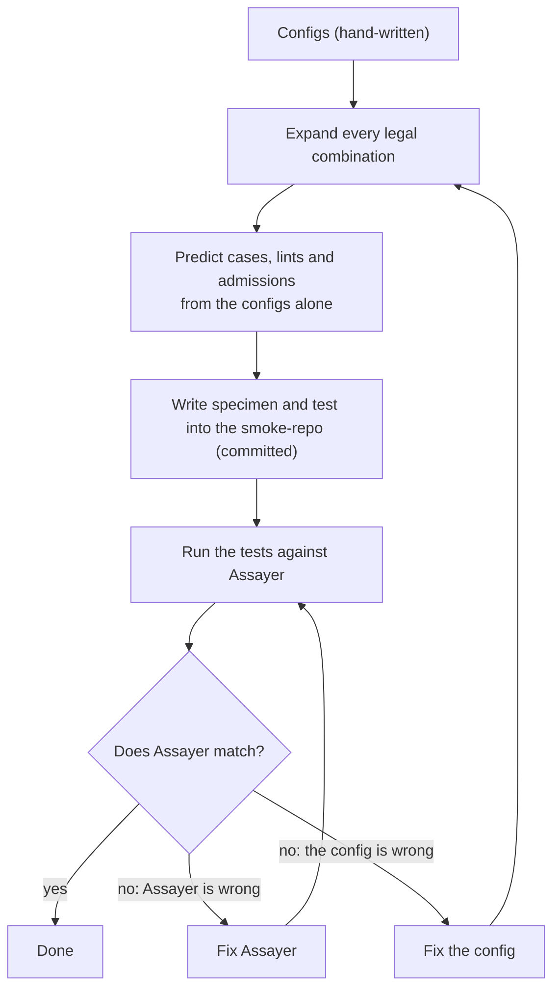

# Specimen generator: the plan

This folder plans a generator that writes every specimen in the smoke-repo, plus the test for each one.
A specimen is a small example file under `smoke-repo/packages/syntax-repository/src` that shows one
syntax pattern Assayer claims to handle. Today a human writes each specimen and its test by hand.

Start here. This file says what is decided, what is built, what is open, and what comes next.

## Files in this folder

| File | What it holds |
|---|---|
| `PLAN.md` | This file: the design, the decisions, the open questions, the next steps |
| `SAMPLE-CONFIG.md` | Every config prop, and the prototype's real config files and output. Built by a script from those files |
| `DIMENSIONS.md` | Every list the generator iterates over, and how they multiply into a specimen count |
| `FUTURE-BLOCKS.md` | Candidate containers, values, types, chains, syntaxes and sources to add later |
| `STRESS-TEST-1.md` | First run of the prototype against Assayer: five disagreements, and the decision on each |
| `STRESS-TEST-2.md` | Every config prop tested one at a time, a new undriven example, and a second Assayer run |

## Status

- The design below is agreed.
- A working prototype exists in `tmp/specimen-generator-prototype/`. **`tmp/` is git-ignored.** The
  prototype is not committed, and it is lost if the checkout's ignored files are cleaned.
- No generated file is in the smoke-repo. Each stress test generated into it, ran the tests, and deleted
  the output again.
- The real generator has not been built. Where it will live is undecided.

## What the generator does

A human declares building blocks once. The generator crosses them into every legal combination, writes a
specimen file and a test for each, and the test checks Assayer's real output against a prediction.

| Building block | Example | Declared in |
|---|---|---|
| Syntax | `array/at`: `<T>(chain: T[], index: number) => chain.at(index)` | One config file per syntax |
| Container | `function-params`: the syntax sits in an exported function whose parameters feed the holes | `vocabulary.ts` |
| Source | `param`, `literal`, `same-file-const`, `call-arg-literal`, `opaque-call`, or another syntax | `vocabulary.ts`, and each hole's `sources` |
| Demand | `index-free`: try `0`, `-1` and `7` for an index into an array of unknown length | `vocabulary.ts` |

Adding one block reaches every combination it applies to:

| You add | What changes | What the generator does |
|---|---|---|
| A container | `vocabulary.containers`, plus `true` in each syntax that allows it | Writes one specimen per syntax that allows it |
| A value such as `NaN` | The demands that should try it | Every specimen using that demand gains the case |
| A syntax | One new config file | Writes one specimen per allowed container and source |
| A source | `vocabulary.sources`, plus the containers that offer it | Every hole that lists it gains an option |
| A chain, such as `.slice(1)` feeding an array hole | A new syntax, listed as `{ syntax }` in the holes it can fill | Every such hole gains an option |

## The loop

- **A new behavior starts as a config change.** Add `NaN` to a demand and regenerate. Every specimen
  using that demand now expects a `NaN` case and fails until Assayer handles it.
- **An Assayer change shows its full reach.** The generated tests that fail name every syntax and
  container the change touched.
- **The prediction never comes from running Assayer.** Copying Assayer's output into a prediction would
  break rule P4: an expected value must never come from the code under test. When a generated test
  fails, a human decides which side is wrong.

## Decisions

| Topic | Decision |
|---|---|
| Folder layout | `src/syntax/<group>/<name>/<specimen>/` for generated specimens, `src/complex/<name>/` for curated ones. The `happy-path/` and `sad-path/` folders go away |
| Group | Each syntax belongs to a group: `array`, `string`, `control-flow`, and later `react` for `react/create-element` |
| Config location | The config folders mirror the output: `configs/syntax/<group>/<name>/<name>.config.ts` |
| Meta props | Every config starts with `type`, then `group` for a syntax, then `name` and `description` |
| `.length` | `array/length` and `string/length` are separate syntaxes, because they take different inputs |
| Templates | A template is a typed arrow function, parsed with the TypeScript compiler. The generator swaps syntax tree nodes and never edits text |
| Containers | A container is TypeScript with marker identifiers, also swapped as nodes |
| Complex entries | The generator writes them too. They turn every container off and write their expected results out by hand |
| Expected results | Syntax entries get them from the outcome rules below. Only complex entries write them by hand |
| Naming an exit | A test names an exit by its line, through `exitOnLine(n)`. The generator knows every line because it parses its own output |
| Generated files | Committed, so `git diff` shows what a config change rewrote. A check fails if regenerating would change a committed file |
| Verdict | Each specimen's clean or unclean verdict comes from its predicted lints and admissions. A generated manifest replaces `specimen-registry.ts` and the folder-based rule in `bucket-verdict.ts` |
| Performance | Ignored until the structures exist |

The decisions on each disagreement with Assayer are in `STRESS-TEST-1.md` and `STRESS-TEST-2.md`.

## The outcome rules

These rules turn one combination into the cases, lints and admissions its test expects. They are
implemented in the prototype's `predict` function.

1. **No entry, nothing expected.** A container with `entryKind: 'none'`, such as `object-prop`, predicts
   nothing. So does `module-scope` holding a syntax that does not branch.
2. **An opaque branch is undriven.** If a branch's deciding hole comes from a source that is neither
   settable nor known, the entry has no cases and one undriven admission. Its wording comes from
   `admissionMessages['undriven-branch']`.
3. **Settable holes are crossed.** Each hole whose source is settable contributes its demand's values.
   The cases are every combination, with the first hole varying fastest.
4. **A nested syntax gets its values through `inverse`.** When `string/length` fills `.at`'s index, the
   index values `.at` needs become strings of those lengths. Negative values are dropped.
5. **Which exit a case reaches.** A syntax that does not branch reaches the entry's `return`, plus the
   private helper's `return` first in a `function-via-inner` container. A branching syntax reaches the
   arm that `decide` picks. In a container whose arms do not exit, the last arm is the code after the
   branch, so reaching it means reaching the end of the file.
6. **Salient.** The first case to reach each distinct exit path is salient. Later cases on the same path
   are grayed out.
7. **A locked branch has dead arms.** If a branch has no settable hole, `decide` picks one live arm.
   Every other arm that exits gets an `unreachable-exit` lint, worded from
   `lintMessages['unreachable-exit']`. A fall-through arm is never dead, because the code after the
   branch runs either way.
8. **Verdict.** Any lint or admission makes the specimen unclean.

## Carrying over today's hand-written specimens

On 2026-10-08 the catalogue held 115 specimen source files and 118 test files. Each one gets one of two
destinations, recorded in a table in this folder:

1. **A generated combination under `src/syntax/`.** If none matches, the configs are missing a syntax, a
   container or a source, and that gets added first.
2. **A complex entry under `src/complex/`**, only when the grid really cannot express it. Likely
   candidates are `harness/` and `input-gap/` (identical files that differ only by a harness file),
   `composition/`, and multi-file setups such as `env-object/`.

The hand-written originals are deleted only after every row has a destination and both
`npm run test:syntax` and `npm run ward` pass.

## Open questions

| Question | Where it came from |
|---|---|
| How should Assayer handle `.length` of one unknown array used as an index into another? | `STRESS-TEST-1.md`, cause D |
| Should Assayer try more than one string value? If so, which ones? | `STRESS-TEST-2.md`, cause F |
| Should Assayer report an undriven branch inside a private helper? Today it reports nothing, which looks like a clean result | `STRESS-TEST-2.md`, cause G |
| Keep `decide` as its own declaration, or read the condition from the template? `decide` repeats the template's condition, but it keeps the prediction independent of the code | `STRESS-TEST-2.md`, finding 1 |
| What should `[10, 20, 30].at(3)` report, where the index is always past the end? An unreachable lint, or a P1 build error? | The first conversation about the generator |
| Literals ignore the generic type: `array/length` with string elements still writes `[10, 20, 30]` | `STRESS-TEST-1.md`, problem 2 |
| Two generated module-scope files that declare the same top-level name clash in TypeScript. Does adding `export {};` change Assayer's analysis? | `STRESS-TEST-1.md`, problem 3 |
| The `unreachable-exit` wording differs for a value locked to an array's fixed length, or for a condition made only of literals. The config holds only one wording | `STRESS-TEST-2.md`, finding 2 |
| A nested syntax's own holes get one fixed source each. Letting them vary multiplies the matrix at every nesting level | `DIMENSIONS.md` |
| Where does the real generator live: its own package, or a script under `packages/core/test/`? How do its generated tests meet the dungeonmaster lint and testing rules? | Not yet discussed |

## Next steps

1. **Express today's specimens in the config.** Several sub-agents each take a slice of today's
   specimens, write the config that would generate each one, run the prototype, and fill in the
   carry-over table. Each reports what the config cannot express.
2. **Test the future blocks.** Sub-agents take blocks from `FUTURE-BLOCKS.md` and write the config change
   each one needs. A block that needs changes in more than one place is a finding.
3. **Fix Assayer** for the disagreements decided as Assayer's to fix: causes A, B, C and E in
   `STRESS-TEST-1.md`, plus cause G if decided.
4. **Build the real generator** once the config shape stops changing.

## State of the repo for the next session

Nothing below is committed.

| Change | Files | Notes |
|---|---|---|
| One-line fix in the root `CLAUDE.md` | `CLAUDE.md` | Points at `compileSmokeCache` in `packages/app/test/harnesses/smoke-cache.harness.ts`, the real source of the e2e cache steps |
| `npm run typecheck:syntax` fix | `smoke-repo/packages/syntax-repository/tsconfig.json`, `packages/core/index.ts`, `packages/core/src/contracts/harness-declaration/harness-declaration-contract.ts`, `packages/core/src/transformers/assayer-harness/assayer-harness-transformer.ts` | The tsconfig maps each `#gateway/...` import at its source. The core change lets an author write a harness that typechecks. `typecheck:syntax` exits 0, `test:syntax` is unchanged, `ward --changed` passes |
| This folder | `scrolls/specimen-generator/` | Untracked |
| The prototype | `tmp/specimen-generator-prototype/` | Git-ignored. `generate.ts`, `mutate.py`, `build-sample-doc.py`, `configs/` |

The tsconfig fix lists each `#gateway/...` import by hand. A comment says a new gateway import in core
needs a line there. Nothing enforces that yet. A test that fails on an unmapped gateway import would.

Two failures exist on master and were not caused by this work:

- `analyze-file-broker.integration.test.ts` fails because `happy-path/array/length-at` has no line in
  `packages/core/test/harnesses/specimen-registry.ts`. That line has to be written by reading the
  specimen.
- `run-unit-broker.integration.test.ts` passes, but ward fails it for leaving a child process running.
